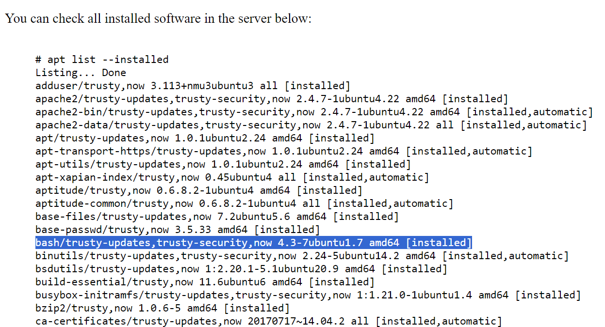
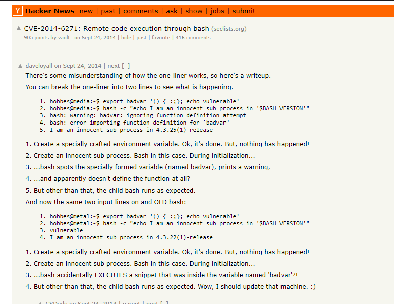
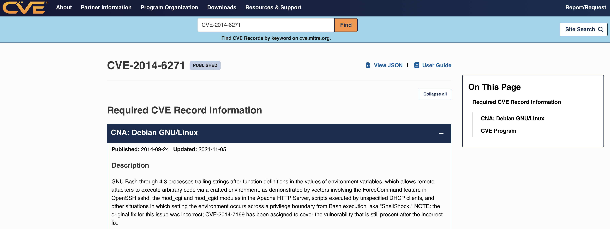
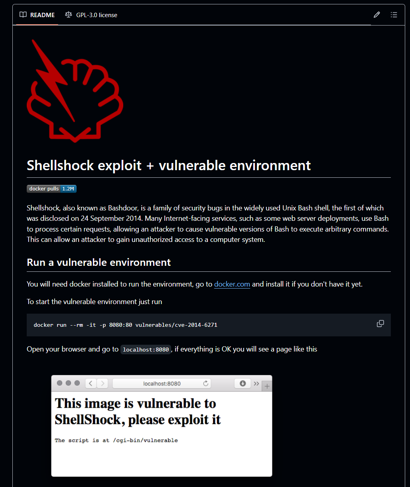
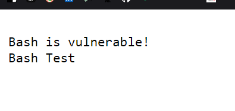
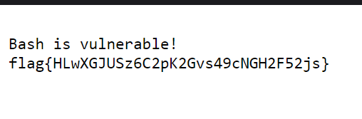

# CTF Semana #4 (Environment Variables)

Este documento apresenta as etapas seguidas para a detecção de uma vulnerabilidade relacionada com as variáveis de ambiente para a execução de programas em sistemas Linux, utilizando o servidor cujo backend corre em Linux, http://ctf-fsi.fe.up.pt:5002.

## 1. Reconhecimento

O Bash é um componente importante do Linux, devido ao seu papel central na interação com o sistema e na manipulação de variáveis de ambiente. Assim, a configuração e a versão do Bash são fatores muito importantes na segurança do servidor.

Analisando o software instalado, ao pesquisarmos por 'bash' encontramos apenas uma resposta, que indica a versão instalada (Figura 1).



*Figura 1: versão instalada do Bash.*

## 2. Pesquisa por Vulnerabilidades

Com a informação identificada na Etapa 1, procuramos pela versão especificada do Bash numa [Base de Dados](https://cve.mitre.org) com CVEs conhecidas e no Google. Utilizamos prompts como:

- bash 4.3
- bash 4.3 ubuntu 1.7
- bash now 4.3-7ubuntu1.7 amd64


## 3. Escolha da Vulnerabilidade

Após algumas pesquisas, finalmente encontramos uma página que nos indicou a [CVE-2014-6271](https://news.ycombinator.com/item?id=8361574), também conhecida como 'ShellShock' (Figura 2).



*Figura 2: CVE para 'bash now 4.3-7ubuntu1.7 amd64'.*

Utilizamos também a [Base de Dados](https://cve.mitre.org) indicada na Etapa 2 para percebermos esta vulnerabilidade em maior detalhe (Figura 3).



*Figura 3: Detalhes da CVE-2014-6271.*

Assim, a CVE correta foi submetida como **flag{CVE-2014-6271}**.


## 4. Encontrar um Exploit

Após a identificação da CVE correta, foi utilizado o Google para localizar uma exploit conhecida. Encontramos um [Repositório Github](https://github.com/opsxcq/exploit-CVE-2014-6271) com um exploit (Figura 4).



*Figura 4: Exploit para a CVE-2014-6271.*

Embora não tenha fornecido diretamente a resposta, indiretamente nos indicou a função que nos guiou na direção correta. Através do seguinte comando fornecido no repositório, descobrimos que poderimos usar a barra de pesquisa do servidor como um exploit (Figura 5):

```shell
env 'VAR=() { :;}; echo Bash is vulnerable!' 'FUNCTION()=() { :;}; echo Bash is vulnerable!' bash -c "echo Bash Test"
```



*Figura 5: Resultado após correr comando na barra de pesquisa.*

## 5. Explorar a Vulnerabilidade

Através de tentativa/erro fomos explorando diferentes diretórios do servidor até encontrarmos o diretório `/var/flag/` com um ficheiro chamado `flag.txt`, que nos pareceu promissor a incluir a flag para resolver o CTF!

Para extrair o conteúdo do ficheiro, adaptamos o comando da Etapa 4 e colocamos na barra de pesquisa para fazer o exploit:

```shell
env 'VAR=() { :;}; echo Bash is vulnerable!' 'FUNCTION()=() { :;}; echo Bash is vulnerable!' bash -c "cat /var/flag/flag.txt"
```

A nossa intuição estava certa e conseguimos encontrar a segunda flag do desafio: **flag{HLwXGJUSz6C2pK2Gvs49cNGH2F52js}** (Figura 6).



*Figura 6: flag após exploit da CVE.*

Esta vulnerabilidade poderia ter sido evitada mantendo o sistema e todos os pacotes instalados na versão mais atualizada. A vulnerabilidade Shellshock foi corrigida em versões mais recentes do Bash. Assm, garantir que o Bash está sempre na versão mais recente minimiza o risco desta exploração.