# Relatório: Public-Key Infrastructure (PKI) Lab

## Lab Environment

Antes de iniciar a execução das atividades descritas no guião, foram necessários os seguintes passos de configuração e preparação do ambiente:

### 1. Configuração do DNS
    
Para garantir a correcta resolução de nomes no nosso ambiente, foi realizada a configuração do arquivo de hosts. O processo envolveu a execução do seguinte comando:

```
$ sudo vim /etc/hosts
```

A seguir, foi efectuada a alteração necessária no arquivo conforme ilustrado na figura abaixo:


### 2. Configuração do Contentor e Comandos

Para configurar o ambiente de contentores Docker, foi necessário inicializar o contentor correspondente, utilizando os comandos seguintes:

```
$ docker-compose up
$ docker-compose build
```

A execução destes comandos iniciou o processo de construção e levantamento dos contentores definidos no ficheiro docker-compose.yml. A seguir, o ambiente de contentores foi iniciado com sucesso, conforme ilustrado na figura abaixo:


## Task 1: Becoming a Certificate Authority (CA)

### 1. Preparação do Ambiente

Criamos um diretório de trabalho no Desktop chamado PKI.

Para usar o OpenSSL na criação de certificados, é necessário ter um ficheiro de configuração, com a extensão `.cnf`. Este ficheiro é utilizado por três comandos principais do OpenSSL: `ca`, `req` e `x509`. O ficheiro de configuração por defeito no OpenSSL está localizado em `/usr/lib/ssl/openssl.cnf`. No entanto, como necessitamos de realizar alterações no mesmo, copiámos esse ficheiro para o nosso diretório de trabalho (PKI) e instruímos o OpenSSL a utilizá-lo, efetuando o seguinte comando:


### 2. Criação de Diretórios e Ficheiros de Configuração

Para garantir o correto funcionamento do nosso ficheiro de configuração, foi necessário criar os seguintes diretórios: 

- No diretório PKI, criamos "demoCA":

    

- No diretório demoCA, criamos "certs", "newcerts" e "crl":

    

Além disso, dentro do diretório demoCA criámos dois ficheiros vazios, "index.txt" e "serial", através dos seguintes comandos:

```
$ touch index.txt
$ touch serial
```

Em seguida, inserimos um número no ficheiro `serial`, neste caso, o número 1004, conforme mostrado na imagem a seguir:

```
$ gedit serial
```


### 3. Alteração do Ficheiro de Configuração

Abrindo o ficheiro de configuração do OpenSSL:


foi necessário remover o comentário da seguinte linha para permitir a criação de múltiplos certificados com o mesmo sujeito, o que é comum em cenários de laboratório:

```
unique_subject = no
```


### 4. Geração do Certificado Autoassinado para a CA

Após as configurações anteriores, o próximo passo foi gerar o certificado autoassinado para a nossa CA. Utilizámos o seguinte comando:

```
$ openssl req -x509 -newkey rsa:4096 -sha256 -days 3650 -keyout ca.key -out ca.crt
```

Este comando gerou dois ficheiros importantes:

- ca.key: A chave privada da nossa CA, que será usada para assinar outros certificados.
- ca.crt: O certificado público autoassinado da nossa CA.

Fomos solicitados a fornecer uma palavra-passe para proteger a chave privada, e a preencher a informação do sujeito, como o Common Name (CN), Organização (O) e País (C).


Para evitar ser solicitado a preencher essas informações manualmente, podemos utilizar diretamente seguinte comando, que inclui as informações do sujeito e a palavra-passe diretamente:

```
$ openssl req -x509 -newkey rsa:4096 -sha256 -days 3650 -keyout  ca.key -out ca.crt \
-subj "/CN=www.modelCA.com/O=Model CA LTD./C=US" \
-passout pass:dees
```

### 5. Verificação do Certificado e da Chave Privada

Após a criação da nossa CA e dos ficheiros correspondentes, foi possível inspecionar o conteúdo dos ficheiros gerados utilizando os seguintes comandos:

- Para visualizar o conteúdo do certificado X.509 da nossa CA:

    ```
    $ openssl x509 -in ca.crt -text -noout
    ```

    Este comando gerou o seguinte conteúdo:

    ```
    Certificate:
    Data:
        Version: 3 (0x2)
        Serial Number:
            29:31:a2:65:5b:73:c1:78:92:c3:6e:00:cd:2b:20:03:1a:73:42:4e
        Signature Algorithm: sha256WithRSAEncryption
        Issuer: CN = www.modelCA.com, O = Model CA LTD., C = US
        Validity
            Not Before: Dec  4 10:02:59 2024 GMT
            Not After : Dec  2 10:02:59 2034 GMT
        Subject: CN = www.modelCA.com, O = Model CA LTD., C = US
        Subject Public Key Info:
            Public Key Algorithm: rsaEncryption
                RSA Public-Key: (4096 bit)
                Modulus:
                    00:d5:7d:c7:e7:7e:ca:df:89:39:55:84:70:11:a1:
                    5d:22:a7:05:44:14:26:ba:e6:50:74:6e:ea:ce:2d:
                    4d:49:5c:e4:ce:e8:ba:47:55:25:03:4a:f0:14:15:
                    e1:f5:9a:c8:be:8e:1e:92:3b:b0:de:ea:2d:cd:7a:
                    ce:c9:76:05:f2:7c:af:18:1e:45:c8:fb:c8:1f:d5:
                    ea:f7:2a:e3:d3:61:94:e6:b4:f7:76:f5:c8:cd:f6:
                    cf:5e:b9:c9:8d:82:3f:36:ee:81:00:d3:21:b4:7d:
                    cb:6a:fe:b5:e7:dc:57:8d:97:6b:08:7b:21:a3:0e:
                    fe:d8:6f:7f:89:f2:13:5f:2f:aa:2e:0d:8e:91:0e:
                    70:a1:87:43:4c:6f:f3:d4:6d:7f:c4:b1:d0:cd:c1:
                    db:fa:b3:15:97:ea:be:b5:6a:06:dc:23:bb:cd:ee:
                    52:d7:e9:1b:04:cb:a6:70:0e:c0:f5:25:00:7b:c3:
                    7f:5f:10:6d:20:ee:26:04:fb:c1:8d:3e:1b:e9:24:
                    73:53:bf:ce:2e:42:ff:df:48:75:e1:56:9a:79:39:
                    16:12:ee:10:14:6c:ae:b7:38:3f:04:bb:9e:21:0b:
                    bc:f9:7c:fb:29:12:ad:58:fb:64:25:d9:51:7e:ae:
                    52:c0:0d:45:70:8c:9b:d3:3d:b2:04:bd:71:d6:de:
                    28:60:0b:85:5d:c2:73:a1:94:52:f9:2e:07:58:5d:
                    21:d4:34:61:b6:be:35:93:88:e1:08:b9:3e:73:e2:
                    fe:8d:a6:82:98:30:af:38:8e:96:4f:05:aa:e5:13:
                    03:e2:be:8b:6a:65:2b:5f:2b:5e:ed:16:9a:33:71:
                    27:3c:04:51:0f:5f:df:27:6f:df:d1:6e:58:d9:e1:
                    d9:67:2c:a2:1a:cb:a9:52:f4:4b:73:9f:c2:96:d9:
                    e1:71:37:cf:2c:46:0b:5d:75:88:45:45:df:de:b9:
                    5a:26:a7:96:56:6f:2f:2a:55:7d:91:5c:64:14:0f:
                    61:f1:53:d7:a7:0d:a8:7e:e0:c2:fa:60:a4:26:92:
                    90:e7:54:6b:19:5c:51:87:7b:4d:36:e7:32:6f:65:
                    f5:9c:ad:b5:00:36:bb:eb:e2:16:4d:c4:6b:ad:3c:
                    1b:89:c3:04:35:e2:80:19:09:0a:b4:8d:a3:5d:26:
                    80:cd:12:42:3c:d6:8d:6f:ba:14:ba:20:57:49:90:
                    ca:f1:f2:b9:08:6d:d1:f7:22:4a:ca:ec:d2:fd:90:
                    e7:ce:e5:ab:96:13:00:ac:c9:5b:8a:e1:e5:7c:97:
                    59:b9:82:34:ca:0b:6d:88:87:77:2d:7f:0d:0d:8a:
                    8d:50:55:be:36:78:ee:f1:2c:55:4e:d4:a4:53:d2:
                    73:73:57
                Exponent: 65537 (0x10001)
        X509v3 extensions:
            X509v3 Subject Key Identifier: 
                87:62:AE:A4:0C:A5:AA:39:83:F0:16:07:88:EB:D4:82:FF:6B:4B:E6
            X509v3 Authority Key Identifier: 
                keyid:87:62:AE:A4:0C:A5:AA:39:83:F0:16:07:88:EB:D4:82:FF:6B:4B:E6

            X509v3 Basic Constraints: critical
                CA:TRUE
    Signature Algorithm: sha256WithRSAEncryption
         69:95:4e:55:79:7f:3d:cc:af:e0:d1:18:25:2b:4d:3e:25:b1:
         81:a1:49:95:01:6d:94:08:50:11:f8:9c:2d:9a:40:42:2c:4b:
         41:02:13:93:4e:1c:ca:e4:0a:a0:78:79:4c:6a:15:be:72:23:
         9e:d9:06:b3:ad:7b:f5:66:17:37:8b:0c:b4:d7:90:2c:8e:d4:
         08:ad:db:94:6b:7f:0a:b9:0b:93:b8:db:6c:f9:65:5b:da:31:
         29:67:81:8f:a6:92:01:e1:7d:37:89:4e:86:94:3b:56:b4:c7:
         48:66:68:07:13:89:3a:d7:c0:c1:10:6d:3e:13:c5:38:d3:ec:
         88:b4:ff:3c:f9:61:c8:f9:eb:96:94:05:89:49:88:f6:c1:09:
         be:ed:e9:44:4c:e6:d2:d6:ab:6b:74:4b:50:49:a9:5b:37:a4:
         80:55:d9:e1:e3:9d:d5:73:4b:66:41:ac:c9:34:5e:53:88:e4:
         48:df:7e:5c:67:86:1c:6a:86:e5:db:72:27:bd:e3:fd:bb:76:
         dd:e8:cc:08:2d:8c:fb:40:53:a7:a2:98:2e:7b:bc:f7:b6:d6:
         a6:71:e2:f7:09:40:04:7d:06:0a:c8:7f:e0:27:b4:d0:b6:ff:
         92:39:cd:22:58:86:d3:2f:fd:1a:16:5f:be:33:9b:53:3b:07:
         22:27:9f:11:17:51:06:f0:37:f2:87:02:df:82:52:3e:13:03:
         86:a3:0d:a3:37:0d:81:fe:58:38:44:fc:34:78:65:02:06:22:
         b8:e7:84:fd:15:14:d8:f8:fe:8b:12:b9:02:db:63:4a:1c:98:
         68:43:57:69:40:01:4b:39:bb:f1:52:d6:c7:1a:12:9c:b2:0c:
         87:dc:e9:69:ac:9b:3f:4f:b3:cf:ec:9a:dd:ea:2d:fd:aa:c6:
         fd:a6:d2:3f:1d:22:ba:2b:4a:4a:16:3f:30:c7:8c:9c:0b:b1:
         0c:30:9d:40:b8:bf:b4:74:d4:ee:5a:61:0c:39:42:c6:23:7e:
         a0:50:a7:5c:45:3d:ad:cf:ce:e5:73:ab:fb:d7:9c:68:54:20:
         6a:16:32:17:c6:16:34:b0:ca:bf:a9:2d:a0:a7:5d:8d:49:9b:
         88:2c:2b:9d:27:c4:06:de:e0:c4:d9:a8:35:4a:52:35:5b:92:
         9a:b1:18:7a:1e:4b:86:1f:a2:dc:e9:30:8f:8d:52:94:3c:6c:
         d3:17:83:81:2e:5b:6f:87:f9:ed:cc:15:23:30:1a:8f:a4:79:
         14:2d:c4:28:40:21:13:4b:98:2d:7d:a0:ff:78:04:e9:65:59:
         df:34:16:70:ce:3e:5f:b9:46:ed:7b:39:13:27:3e:5f:af:e4:
         08:3d:da:09:42:98:f0:2e
    ```

    Para visualizar os detalhes da chave privada RSA:

    ```
    $ openssl rsa -in ca.key -text -noout
    ```

    Após efetuar este comando, foi nos solicitada a palavra passe (dees) e foi gerado o seguinte conteúdo:

    ```
    RSA Private-Key: (4096 bit, 2 primes)
    modulus:
        00:d5:7d:c7:e7:7e:ca:df:89:39:55:84:70:11:a1:
        5d:22:a7:05:44:14:26:ba:e6:50:74:6e:ea:ce:2d:
        4d:49:5c:e4:ce:e8:ba:47:55:25:03:4a:f0:14:15:
        e1:f5:9a:c8:be:8e:1e:92:3b:b0:de:ea:2d:cd:7a:
        ce:c9:76:05:f2:7c:af:18:1e:45:c8:fb:c8:1f:d5:
        ea:f7:2a:e3:d3:61:94:e6:b4:f7:76:f5:c8:cd:f6:
        cf:5e:b9:c9:8d:82:3f:36:ee:81:00:d3:21:b4:7d:
        cb:6a:fe:b5:e7:dc:57:8d:97:6b:08:7b:21:a3:0e:
        fe:d8:6f:7f:89:f2:13:5f:2f:aa:2e:0d:8e:91:0e:
        70:a1:87:43:4c:6f:f3:d4:6d:7f:c4:b1:d0:cd:c1:
        db:fa:b3:15:97:ea:be:b5:6a:06:dc:23:bb:cd:ee:
        52:d7:e9:1b:04:cb:a6:70:0e:c0:f5:25:00:7b:c3:
        7f:5f:10:6d:20:ee:26:04:fb:c1:8d:3e:1b:e9:24:
        73:53:bf:ce:2e:42:ff:df:48:75:e1:56:9a:79:39:
        16:12:ee:10:14:6c:ae:b7:38:3f:04:bb:9e:21:0b:
        bc:f9:7c:fb:29:12:ad:58:fb:64:25:d9:51:7e:ae:
        52:c0:0d:45:70:8c:9b:d3:3d:b2:04:bd:71:d6:de:
        28:60:0b:85:5d:c2:73:a1:94:52:f9:2e:07:58:5d:
        21:d4:34:61:b6:be:35:93:88:e1:08:b9:3e:73:e2:
        fe:8d:a6:82:98:30:af:38:8e:96:4f:05:aa:e5:13:
        03:e2:be:8b:6a:65:2b:5f:2b:5e:ed:16:9a:33:71:
        27:3c:04:51:0f:5f:df:27:6f:df:d1:6e:58:d9:e1:
        d9:67:2c:a2:1a:cb:a9:52:f4:4b:73:9f:c2:96:d9:
        e1:71:37:cf:2c:46:0b:5d:75:88:45:45:df:de:b9:
        5a:26:a7:96:56:6f:2f:2a:55:7d:91:5c:64:14:0f:
        61:f1:53:d7:a7:0d:a8:7e:e0:c2:fa:60:a4:26:92:
        90:e7:54:6b:19:5c:51:87:7b:4d:36:e7:32:6f:65:
        f5:9c:ad:b5:00:36:bb:eb:e2:16:4d:c4:6b:ad:3c:
        1b:89:c3:04:35:e2:80:19:09:0a:b4:8d:a3:5d:26:
        80:cd:12:42:3c:d6:8d:6f:ba:14:ba:20:57:49:90:
        ca:f1:f2:b9:08:6d:d1:f7:22:4a:ca:ec:d2:fd:90:
        e7:ce:e5:ab:96:13:00:ac:c9:5b:8a:e1:e5:7c:97:
        59:b9:82:34:ca:0b:6d:88:87:77:2d:7f:0d:0d:8a:
        8d:50:55:be:36:78:ee:f1:2c:55:4e:d4:a4:53:d2:
        73:73:57
    publicExponent: 65537 (0x10001)
    privateExponent:
        0b:d0:b1:3e:8b:92:d8:ba:34:75:1a:26:45:a3:83:
        8f:06:65:51:36:38:4a:81:b2:94:2f:0b:49:ab:d2:
        2a:2c:3c:f1:82:89:c4:a6:de:ac:86:fa:30:72:61:
        96:01:21:f9:01:ce:89:53:4a:5f:9b:e0:3b:0d:ff:
        e1:c0:69:65:d9:26:ab:94:09:52:ad:34:8f:26:7c:
        a1:7f:3b:2a:98:ac:ef:f3:b5:fa:5c:71:e7:8c:30:
        3f:d2:d2:67:c5:7c:90:22:b4:fb:01:b4:4c:d3:e5:
        6d:1f:79:9b:c2:63:0a:10:06:39:6a:ef:1a:a2:1a:
        d2:89:a1:2a:56:3e:62:37:36:18:e4:61:2e:7f:f9:
        15:c7:71:9f:0a:57:19:3b:92:25:a5:9d:a3:b5:85:
        e2:23:05:1f:ea:3a:f1:b9:53:75:dd:78:68:56:37:
        39:81:ca:20:02:d1:4c:44:54:c3:7c:6f:c1:69:b9:
        63:de:79:db:a7:b2:6c:f6:2d:e9:0e:35:e7:3a:40:
        33:b3:5a:ca:ce:a4:70:8c:07:12:18:83:e6:0f:95:
        bc:28:76:b5:5a:aa:74:b3:65:31:72:dc:b6:81:7a:
        cc:e7:f0:d2:7e:19:1f:e2:91:d1:52:6c:a3:31:2c:
        9d:3a:5e:cc:72:cb:b0:ee:2a:2a:fe:fd:0c:e2:30:
        a3:be:27:10:75:f4:75:7f:dd:2b:50:48:31:99:a9:
        33:5c:05:db:e5:60:02:0b:46:06:41:4f:40:dd:01:
        0c:a6:06:ae:cf:6b:30:97:18:6e:bc:71:bb:56:40:
        79:2c:ae:61:48:26:6c:34:56:d9:16:6c:90:a3:d4:
        05:06:0f:8e:a6:d6:75:34:15:a0:e3:f2:78:96:36:
        bb:7f:38:43:b9:9a:7f:bb:01:c9:bc:b2:3c:0f:b7:
        b9:2f:87:ca:9f:af:a7:4f:5a:c2:0c:44:3a:92:8b:
        af:ed:5d:e5:ef:ba:df:9f:ec:09:8a:25:fe:38:5e:
        90:c1:4b:eb:b0:7b:0d:eb:45:d8:d6:29:c1:9d:b3:
        d3:a8:a3:3c:0a:f4:72:2d:8e:dd:df:c9:ad:60:e3:
        a5:c4:11:af:64:75:fe:46:e2:e9:69:67:6e:0b:29:
        06:61:e9:42:34:61:dd:c0:a8:7c:fc:80:1c:85:d0:
        84:86:b8:27:80:88:24:f2:3f:4b:da:31:ff:cb:19:
        21:35:0a:2c:d3:26:c8:01:18:68:0e:c2:4f:e5:43:
        13:e0:5c:49:2b:3e:2d:6b:ac:03:81:ed:f5:68:75:
        60:72:31:e7:77:a3:b1:8a:87:e7:d4:20:e8:a0:cc:
        97:b4:19:8d:26:78:53:8e:3d:10:6c:1e:5e:32:4d:
        76:11
    prime1:
        00:fe:8c:6a:e0:38:06:83:e5:9a:41:6a:74:8f:f2:
        8b:44:c2:b1:c2:9e:b1:32:d2:de:85:e0:56:6c:35:
        42:e5:e2:ee:00:60:e6:fc:98:f3:05:c8:72:52:a0:
        8b:d2:b0:55:01:98:b8:8a:54:ae:95:1c:87:8f:9a:
        c8:b2:4e:cc:d2:d1:3f:bb:f7:aa:51:b9:61:8c:f2:
        d9:57:6f:58:6a:08:0f:f9:70:88:a2:6d:e0:c5:db:
        26:84:e1:ce:a9:3e:b4:fa:cc:cc:a0:53:66:46:41:
        e1:5d:1e:91:32:e5:68:c6:3e:38:6c:56:10:d8:74:
        47:cd:2a:84:b4:f6:59:9c:44:35:5e:3d:fb:8f:3d:
        02:1a:08:0f:49:e7:9d:37:0b:eb:e3:47:60:ec:e2:
        22:6d:e4:1d:c4:aa:d0:06:00:73:83:94:e7:65:e4:
        d5:43:f4:83:6f:45:75:88:d3:b1:31:c2:e4:2b:18:
        67:2b:18:0f:c6:4a:27:d7:ff:fc:83:28:3c:60:b2:
        cb:26:77:1c:86:23:e0:42:d4:ed:cd:c5:b2:bd:e8:
        6d:88:18:24:a3:2b:f5:e2:db:06:45:82:64:29:f9:
        a9:dc:19:f0:a3:41:fc:f9:ab:2c:ec:6b:c0:d5:91:
        ff:c7:2b:47:8d:04:87:1f:99:3d:d3:1a:05:d8:2c:
        eb:e9
    prime2:
        00:d6:b5:6d:e8:06:b5:3a:2a:18:07:41:c6:f1:9e:
        73:20:cd:1d:75:47:73:38:7a:0c:09:e6:77:82:15:
        e5:d0:b1:64:72:5e:d5:89:ba:e2:1d:12:87:a5:16:
        17:cf:71:5a:cd:d1:b9:d8:17:0f:56:87:f8:c9:93:
        2a:8b:7d:f0:81:d2:f7:67:7a:8a:85:57:3a:2b:de:
        bd:68:84:eb:9c:44:7e:5f:c0:1d:6b:dd:29:b1:ca:
        3b:c9:cc:1c:5c:7a:da:a9:98:02:c5:ff:2d:5d:d4:
        d4:eb:c2:6c:ae:80:b6:d8:76:ee:e9:2b:b3:92:a1:
        12:7d:aa:2b:b4:9c:84:f4:0c:6b:5e:ad:9c:c2:26:
        46:2c:b3:98:7e:16:44:2f:fe:b4:34:dc:ed:ae:db:
        87:d2:2b:b0:d0:f8:d8:e2:d9:0f:85:2c:5b:5b:9b:
        bd:64:e6:9c:3e:01:63:29:f2:6e:c8:fd:44:af:ab:
        b5:80:a1:cb:e5:05:6a:dd:31:9a:01:8f:bf:d2:ca:
        6b:64:31:6a:39:28:bf:da:b3:d2:e0:11:20:c9:9c:
        b2:80:ed:0b:68:ad:7e:a8:49:f2:16:51:c7:70:c7:
        42:25:20:97:17:9f:fe:05:8a:e6:86:94:42:5a:20:
        9d:ef:ad:2c:0b:38:67:c0:52:49:cf:b9:6e:53:cc:
        1d:3f
    exponent1:
        00:cf:80:47:df:5f:cc:6f:d8:cb:56:68:21:7c:f6:
        8a:f1:12:85:35:d1:87:41:97:04:2e:be:21:b5:33:
        f5:c4:d0:a8:93:46:6b:05:9e:e8:fc:dd:d9:d3:e1:
        6c:19:e4:04:67:b8:c7:36:7c:b1:94:7c:1d:45:c3:
        37:b7:a2:e4:f5:35:fe:6e:8c:06:1b:78:b3:3c:e2:
        fa:a9:7b:ea:e7:04:8b:81:1b:6b:46:7d:ab:ad:9e:
        68:58:0a:7b:1d:1c:31:0c:01:c7:0d:2a:ef:44:76:
        8f:f0:08:ea:f4:42:6e:96:ac:41:f2:8e:76:4c:fc:
        fd:4b:12:4d:fb:f6:96:35:fc:a4:44:9e:e2:62:71:
        a9:34:ef:3d:07:51:f7:a6:d7:e1:02:f5:3c:dd:dd:
        b9:93:3b:51:c8:f0:35:83:ae:fa:7b:58:f7:08:e8:
        f1:b0:e3:b2:01:12:ee:2d:0b:e4:76:5c:19:03:c8:
        70:d1:80:5b:db:98:b7:c2:2c:ba:fb:6f:e1:48:32:
        77:c8:73:70:9d:28:c1:b7:b9:3b:e1:72:37:b2:f7:
        b5:d2:2b:5c:32:67:b3:99:aa:52:02:77:b8:8f:3f:
        26:68:75:fc:e4:18:f6:cf:cf:ea:5f:0f:b7:b2:61:
        c1:cf:ea:47:f9:7c:a7:69:ea:d1:ab:34:9b:6f:0d:
        af:81
    exponent2:
        00:94:d7:81:31:70:35:01:f5:5c:62:eb:7e:76:d1:
        59:0e:4c:23:37:c2:28:65:e6:75:a2:07:5a:a1:9b:
        7c:8d:87:ec:12:3d:1b:db:36:ea:b9:2c:b7:4c:02:
        5c:cf:39:cd:b1:10:ca:bc:ba:7f:af:84:e3:3b:1a:
        02:4c:61:29:f1:55:c6:9c:bd:9e:79:81:56:9a:42:
        f7:1b:15:ca:1f:b2:7b:c8:f4:ed:70:71:09:0e:6f:
        1b:b3:71:03:d8:38:72:8d:4f:0b:dd:26:60:d4:c3:
        4e:37:81:b8:c5:e0:04:e1:5a:d1:94:62:ef:41:9e:
        d7:aa:b5:e5:46:77:9a:d3:74:28:9a:a1:d0:21:e7:
        56:8e:76:92:28:16:57:7e:ce:1b:2e:ea:58:fa:f6:
        c4:d9:35:e0:85:7d:7d:1d:05:4c:75:0d:a2:e7:86:
        b7:6c:d3:51:4c:ca:b9:6b:c2:dc:7a:08:d9:2c:ce:
        e4:2c:1f:fd:b0:ee:68:7e:9e:7c:1c:c9:02:39:a6:
        89:7c:13:a5:87:aa:70:15:b4:c3:63:01:7c:b1:47:
        27:97:a8:bc:57:fc:ad:e9:0c:19:fe:cf:02:6b:74:
        36:ae:76:41:47:e7:69:b9:7d:e9:01:32:96:2c:d4:
        9f:a8:1f:6c:80:fa:c1:31:d9:d9:c1:5e:d2:d4:d4:
        93:11
    coefficient:
        42:73:25:3b:d1:86:fa:5b:6c:9f:72:af:00:6e:ed:
        62:b7:12:76:7d:43:31:05:c1:6d:39:58:5a:09:ae:
        8b:e6:ea:ed:a5:cc:75:56:0c:51:11:da:30:92:c8:
        03:39:c2:2a:3e:f6:ec:2a:2d:9d:eb:bc:0b:41:c2:
        3d:51:cf:8f:40:47:13:48:ec:4e:06:ca:57:29:dd:
        7b:3f:03:0a:77:e4:ef:b6:c9:83:98:59:5e:a2:6b:
        9c:ad:f6:d3:7a:bb:d6:6c:f8:0f:e3:50:36:a8:bb:
        41:7c:c6:9f:92:9d:43:ce:91:6e:33:00:fb:28:cf:
        30:e0:52:56:4a:36:d0:93:f9:50:df:bd:0e:97:20:
        b2:b2:00:07:79:84:00:9c:d2:db:fa:a3:5f:15:5a:
        bb:96:56:3e:ad:7c:01:06:c2:89:a5:79:f2:65:71:
        ed:f4:58:68:74:f3:ca:08:e4:4c:14:00:85:2c:87:
        9d:fa:82:5d:cb:07:1b:d2:a8:6d:e4:5f:08:b9:dd:
        ce:a1:e2:9d:d0:15:c7:77:0d:2d:91:7b:8c:dd:c7:
        41:18:57:70:e1:e0:a4:98:c5:c2:8a:f9:85:b2:be:
        b5:af:6e:57:6c:a1:fa:37:bb:13:3c:76:e0:37:e8:
        c0:82:4d:e0:65:d0:5f:d3:e1:3e:28:24:f8:49:15:
        53
    ```

    Esses comandos permitem a visualização dos componentes do certificado e da chave privada em formato legível, para garantir que os mesmos foram gerados corretamente.

### Perguntas

#### What part of the certificate indicates this is a CA’s certificate?

**Resposta:** No certificado X.509 gerado para a nossa CA root, a secção que indica que este é um certificado de uma Autoridade Certificadora (CA) está na extensão X509v3 Basic Constraints. O valor CA:TRUE nesta secção especifica que este certificado é de uma CA e pode ser utilizado para assinar outros certificados.

#### What part of the certificate indicates this is a self-signed certificate?

O certificado gerado para a nossa CA root é autoassinado, o que significa que o Issuer (emissor) e o Subject (sujeito) são idênticos. Quando esses dois campos têm o mesmo valor, é um sinal indicativo de que o certificado foi assinado pela própria CA, em vez de ser assinado por outra CA.

No certificado X.509, é possível verificar que o Issuer e o Subject são exatamente os mesmos.

####  In the RSA algorithm, we have a public exponent e, a private exponent d, a modulus n, and two secret numbers p and q, such that n = pq. Please identify the values for these elements in your certificate and key files.

Para encontrar os valores do expoente público (e), expoente privado (d), módulo (n) e os números secretos p e q no arquivo de chave RSA (gerado como ca.key), podemos usar os comandos do OpenSSL para decodificar a chave privada e visualizar esses valores.

1. Expoente Público (e)

    O expoente público (e) é parte integrante da chave pública RSA. Ele é utilizado durante a criptografia de dados com a chave pública. Ele é mostrado ao visualizar a chave pública da seguinte forma:

    ```
    $ openssl rsa -in ca.key -text -noout
    ```

    No resultado, é possível verificar a chave pública e averiguar que o valor do expoente público é 65537.

2. Expoente Privado (d)

    O expoente privado (d) é a chave secreta utilizada para a operação de descriptografia ou assinatura. Ele é encontrado na chave privada RSA. Abaixo, o valor de d será exibido no comando:

    ```
    $ openssl rsa -in ca.key -text -noout
    ```

    No resultado, é possível verificar a chave privada e o valor do expoente privado.

    ```
    privateExponent:
        0b:d0:b1:3e:8b:92:d8:ba:34:75:1a:26:45:a3:83:
        8f:06:65:51:36:38:4a:81:b2:94:2f:0b:49:ab:d2:
        2a:2c:3c:f1:82:89:c4:a6:de:ac:86:fa:30:72:61:
        96:01:21:f9:01:ce:89:53:4a:5f:9b:e0:3b:0d:ff:
        e1:c0:69:65:d9:26:ab:94:09:52:ad:34:8f:26:7c:
        a1:7f:3b:2a:98:ac:ef:f3:b5:fa:5c:71:e7:8c:30:
        3f:d2:d2:67:c5:7c:90:22:b4:fb:01:b4:4c:d3:e5:
        6d:1f:79:9b:c2:63:0a:10:06:39:6a:ef:1a:a2:1a:
        d2:89:a1:2a:56:3e:62:37:36:18:e4:61:2e:7f:f9:
        15:c7:71:9f:0a:57:19:3b:92:25:a5:9d:a3:b5:85:
        e2:23:05:1f:ea:3a:f1:b9:53:75:dd:78:68:56:37:
        39:81:ca:20:02:d1:4c:44:54:c3:7c:6f:c1:69:b9:
        63:de:79:db:a7:b2:6c:f6:2d:e9:0e:35:e7:3a:40:
        33:b3:5a:ca:ce:a4:70:8c:07:12:18:83:e6:0f:95:
        bc:28:76:b5:5a:aa:74:b3:65:31:72:dc:b6:81:7a:
        cc:e7:f0:d2:7e:19:1f:e2:91:d1:52:6c:a3:31:2c:
        9d:3a:5e:cc:72:cb:b0:ee:2a:2a:fe:fd:0c:e2:30:
        a3:be:27:10:75:f4:75:7f:dd:2b:50:48:31:99:a9:
        33:5c:05:db:e5:60:02:0b:46:06:41:4f:40:dd:01:
        0c:a6:06:ae:cf:6b:30:97:18:6e:bc:71:bb:56:40:
        79:2c:ae:61:48:26:6c:34:56:d9:16:6c:90:a3:d4:
        05:06:0f:8e:a6:d6:75:34:15:a0:e3:f2:78:96:36:
        bb:7f:38:43:b9:9a:7f:bb:01:c9:bc:b2:3c:0f:b7:
        b9:2f:87:ca:9f:af:a7:4f:5a:c2:0c:44:3a:92:8b:
        af:ed:5d:e5:ef:ba:df:9f:ec:09:8a:25:fe:38:5e:
        90:c1:4b:eb:b0:7b:0d:eb:45:d8:d6:29:c1:9d:b3:
        d3:a8:a3:3c:0a:f4:72:2d:8e:dd:df:c9:ad:60:e3:
        a5:c4:11:af:64:75:fe:46:e2:e9:69:67:6e:0b:29:
        06:61:e9:42:34:61:dd:c0:a8:7c:fc:80:1c:85:d0:
        84:86:b8:27:80:88:24:f2:3f:4b:da:31:ff:cb:19:
        21:35:0a:2c:d3:26:c8:01:18:68:0e:c2:4f:e5:43:
        13:e0:5c:49:2b:3e:2d:6b:ac:03:81:ed:f5:68:75:
        60:72:31:e7:77:a3:b1:8a:87:e7:d4:20:e8:a0:cc:
        97:b4:19:8d:26:78:53:8e:3d:10:6c:1e:5e:32:4d:
        76:11
    ```

3. Módulo (n)

    O módulo (n) é o produto de dois números primos (p e q). O módulo é exibido como um número grande no comando que visualiza a chave privada RSA. No output, ele aparecerá logo após a palavra Modulus:

    ```
    modulus:
        00:d5:7d:c7:e7:7e:ca:df:89:39:55:84:70:11:a1:
        5d:22:a7:05:44:14:26:ba:e6:50:74:6e:ea:ce:2d:
        4d:49:5c:e4:ce:e8:ba:47:55:25:03:4a:f0:14:15:
        e1:f5:9a:c8:be:8e:1e:92:3b:b0:de:ea:2d:cd:7a:
        ce:c9:76:05:f2:7c:af:18:1e:45:c8:fb:c8:1f:d5:
        ea:f7:2a:e3:d3:61:94:e6:b4:f7:76:f5:c8:cd:f6:
        cf:5e:b9:c9:8d:82:3f:36:ee:81:00:d3:21:b4:7d:
        cb:6a:fe:b5:e7:dc:57:8d:97:6b:08:7b:21:a3:0e:
        fe:d8:6f:7f:89:f2:13:5f:2f:aa:2e:0d:8e:91:0e:
        70:a1:87:43:4c:6f:f3:d4:6d:7f:c4:b1:d0:cd:c1:
        db:fa:b3:15:97:ea:be:b5:6a:06:dc:23:bb:cd:ee:
        52:d7:e9:1b:04:cb:a6:70:0e:c0:f5:25:00:7b:c3:
        7f:5f:10:6d:20:ee:26:04:fb:c1:8d:3e:1b:e9:24:
        73:53:bf:ce:2e:42:ff:df:48:75:e1:56:9a:79:39:
        16:12:ee:10:14:6c:ae:b7:38:3f:04:bb:9e:21:0b:
        bc:f9:7c:fb:29:12:ad:58:fb:64:25:d9:51:7e:ae:
        52:c0:0d:45:70:8c:9b:d3:3d:b2:04:bd:71:d6:de:
        28:60:0b:85:5d:c2:73:a1:94:52:f9:2e:07:58:5d:
        21:d4:34:61:b6:be:35:93:88:e1:08:b9:3e:73:e2:
        fe:8d:a6:82:98:30:af:38:8e:96:4f:05:aa:e5:13:
        03:e2:be:8b:6a:65:2b:5f:2b:5e:ed:16:9a:33:71:
        27:3c:04:51:0f:5f:df:27:6f:df:d1:6e:58:d9:e1:
        d9:67:2c:a2:1a:cb:a9:52:f4:4b:73:9f:c2:96:d9:
        e1:71:37:cf:2c:46:0b:5d:75:88:45:45:df:de:b9:
        5a:26:a7:96:56:6f:2f:2a:55:7d:91:5c:64:14:0f:
        61:f1:53:d7:a7:0d:a8:7e:e0:c2:fa:60:a4:26:92:
        90:e7:54:6b:19:5c:51:87:7b:4d:36:e7:32:6f:65:
        f5:9c:ad:b5:00:36:bb:eb:e2:16:4d:c4:6b:ad:3c:
        1b:89:c3:04:35:e2:80:19:09:0a:b4:8d:a3:5d:26:
        80:cd:12:42:3c:d6:8d:6f:ba:14:ba:20:57:49:90:
        ca:f1:f2:b9:08:6d:d1:f7:22:4a:ca:ec:d2:fd:90:
        e7:ce:e5:ab:96:13:00:ac:c9:5b:8a:e1:e5:7c:97:
        59:b9:82:34:ca:0b:6d:88:87:77:2d:7f:0d:0d:8a:
        8d:50:55:be:36:78:ee:f1:2c:55:4e:d4:a4:53:d2:
        73:73:57
    ```

    Este valor é o n que será utilizado nas operações de assinatura e verificação.

4. Números secretos p e q

    Os dois números primos secretos (p e q) são utilizados para gerar o módulo n. Eles são necessários apenas no caso da chave privada e são mostrados no comando de visualização da chave privada:

    ```
    $ openssl rsa -in ca.key -text -noout
    ```

    ```
    prime1:
        00:fe:8c:6a:e0:38:06:83:e5:9a:41:6a:74:8f:f2:
        8b:44:c2:b1:c2:9e:b1:32:d2:de:85:e0:56:6c:35:
        42:e5:e2:ee:00:60:e6:fc:98:f3:05:c8:72:52:a0:
        8b:d2:b0:55:01:98:b8:8a:54:ae:95:1c:87:8f:9a:
        c8:b2:4e:cc:d2:d1:3f:bb:f7:aa:51:b9:61:8c:f2:
        d9:57:6f:58:6a:08:0f:f9:70:88:a2:6d:e0:c5:db:
        26:84:e1:ce:a9:3e:b4:fa:cc:cc:a0:53:66:46:41:
        e1:5d:1e:91:32:e5:68:c6:3e:38:6c:56:10:d8:74:
        47:cd:2a:84:b4:f6:59:9c:44:35:5e:3d:fb:8f:3d:
        02:1a:08:0f:49:e7:9d:37:0b:eb:e3:47:60:ec:e2:
        22:6d:e4:1d:c4:aa:d0:06:00:73:83:94:e7:65:e4:
        d5:43:f4:83:6f:45:75:88:d3:b1:31:c2:e4:2b:18:
        67:2b:18:0f:c6:4a:27:d7:ff:fc:83:28:3c:60:b2:
        cb:26:77:1c:86:23:e0:42:d4:ed:cd:c5:b2:bd:e8:
        6d:88:18:24:a3:2b:f5:e2:db:06:45:82:64:29:f9:
        a9:dc:19:f0:a3:41:fc:f9:ab:2c:ec:6b:c0:d5:91:
        ff:c7:2b:47:8d:04:87:1f:99:3d:d3:1a:05:d8:2c:
        eb:e9
    prime2:
        00:d6:b5:6d:e8:06:b5:3a:2a:18:07:41:c6:f1:9e:
        73:20:cd:1d:75:47:73:38:7a:0c:09:e6:77:82:15:
        e5:d0:b1:64:72:5e:d5:89:ba:e2:1d:12:87:a5:16:
        17:cf:71:5a:cd:d1:b9:d8:17:0f:56:87:f8:c9:93:
        2a:8b:7d:f0:81:d2:f7:67:7a:8a:85:57:3a:2b:de:
        bd:68:84:eb:9c:44:7e:5f:c0:1d:6b:dd:29:b1:ca:
        3b:c9:cc:1c:5c:7a:da:a9:98:02:c5:ff:2d:5d:d4:
        d4:eb:c2:6c:ae:80:b6:d8:76:ee:e9:2b:b3:92:a1:
        12:7d:aa:2b:b4:9c:84:f4:0c:6b:5e:ad:9c:c2:26:
        46:2c:b3:98:7e:16:44:2f:fe:b4:34:dc:ed:ae:db:
        87:d2:2b:b0:d0:f8:d8:e2:d9:0f:85:2c:5b:5b:9b:
        bd:64:e6:9c:3e:01:63:29:f2:6e:c8:fd:44:af:ab:
        b5:80:a1:cb:e5:05:6a:dd:31:9a:01:8f:bf:d2:ca:
        6b:64:31:6a:39:28:bf:da:b3:d2:e0:11:20:c9:9c:
        b2:80:ed:0b:68:ad:7e:a8:49:f2:16:51:c7:70:c7:
        42:25:20:97:17:9f:fe:05:8a:e6:86:94:42:5a:20:
        9d:ef:ad:2c:0b:38:67:c0:52:49:cf:b9:6e:53:cc:
        1d:3f
    ```

    Estes valores são os números primos secretos que, quando multiplicados, geram o n (módulo).

## Task 2: Generating a Certificate Request for Your Web Server

### Geração do Pedido de Assinatura de Certificado (CSR)

Para criar o CSR, utilizámos o comando do OpenSSL com a opção req, que gera uma nova chave pública/privada e, ao mesmo tempo, cria o CSR. O comando utilizado foi o seguinte:

```
$ openssl req -newkey rsa:2048 -sha256 \
-keyout server.key -out server.csr \
-subj "/CN=www.bank32.com/O=Bank32 Inc./C=PT" \
-passout pass:dees
```


Explicação do comando:
- `req`: Comando utilizado para gerar um pedido de assinatura de certificado.
- `-newkey rsa:2048`: Gera uma chave RSA de 2048 bits.
- `-sha256`: Utiliza o algoritmo de hash SHA-256 para a assinatura.
- `-keyout server.key`: Especifica o ficheiro onde a chave privada será salva.
- `-out server.csr`: Especifica o ficheiro onde o CSR será gerado.
- `-subj`: Define o campo Subject com as informações de identidade do servidor, incluindo o nome comum (CN), organização (O) e país (C).
- `-passout pass:dees`: Define a palavra-passe para proteger a chave privada gerada.

Este comando gerou dois ficheiros importantes:

1. `server.key`: A chave privada do servidor.
2.`server.csr`: O pedido de assinatura de certificado, que inclui a chave pública do servidor e as informações de identidade (como o nome do domínio).


### Inspecionar o Pedido de Assinatura de Certificado (CSR)
Após a geração do CSR, utilizámos o seguinte comando para verificar o conteúdo do CSR e confirmar as informações nele contidas:

```
$ openssl req -in server.csr -text -noout
```

Este comando exibiu o conteúdo do CSR em formato legível, permitindo verificar as informações do servidor e da chave pública associada.

```
Certificate Request:
    Data:
        Version: 1 (0x0)
        Subject: CN = www.bank32.com, O = Bank32 Inc., C = US
        Subject Public Key Info:
            Public Key Algorithm: rsaEncryption
                RSA Public-Key: (2048 bit)
                Modulus:
                    00:dc:ef:85:12:59:54:1d:4d:50:81:27💿a5:44:
                    d5:3f:32:7f:d0:26:d1:8b:a9:d7:1e:83:f6:3f:bb:
                    be:bc:4a:d7:7d:a4:d1:ba:71:e4:e1:f1:61:5b:01:
                    fc:e8:fe:5b:aa:74:1c:35:c0:e3:68:ed:a7:8d:26:
                    41:5b:5a:5b💿31:34:d7:2c:ad:f6:52:68:d9:3f:
                    7d:1f:c4:36:f5:d3:c0:75:5d:cb:c5:a4:1b:75:fd:
                    b7:16:c6:50:86:45:9e:61:5e:46:90:87:54:b6:7f:
                    01:3f:6c:34:88:30:a4:fd:39:8a:6f:57:3a:54:90:
                    a6:47:b1:4c:04:97:b5:04:35:2b:8e:0b:dc:16:85:
                    40:be:fa:42:a9:e4:81:75:7d:df:bf:c1:82:e8:e2:
                    e2:1f:3b:56:dc:08:35:3f:b7:c0:96:9b:77:ff:1a:
                    f3:7a:2e:c5:1d:a7:56:68:4c:ea🆎99🆎c2:a3:
                    be:65:53:ec:00:a9:b7:a9:1e:78:d8💿c3:77:d8:
                    4a:91:73:73:90:75:d9:9a:8f:d8:db:b9:b4:45:e0:
                    a4:03:ef:a3:3c:7a:82:0f:cb:f9:5a:c8:b4:39:0f:
                    5b:5c:77:05:57:81:13:b0:ba:bb:b0:9d:06:71:ca:
                    ba:56:d4:5b:71:22:19:bb:22:3f:cb:d5:70:7d:b3:
                    1d:21
                Exponent: 65537 (0x10001)
        Attributes:
            a0:00
    Signature Algorithm: sha256WithRSAEncryption
         5b:42:d9:db:15:81:54:9a:f8:23:ef:8f:5c:97:55:0d:bd:37:
         73:ea:03:be:ae:d1:53:00:a9:24:87:e1:a3:f6:23:62:b1:76:
         8a:2c:78:8b:04:85:b6:03:23:45:a8:db:28:40:f9:10:48:8a:
         b6:6b:57:c4:d6:b4:03:6e:26:41:bf:b0:ee:f3:58:73:1a:ad:
         74:d5:74:33:4d:35:37:86:ba:de:50:5a:96:b8:7f:78:c3:74:
         a7:05:23:b5:a8:f5:46:3a:c9:b6:c1:cf:02:c0:ce:61:a2:a5:
         6a:7c:05:5c:7e:ec:8d:39:72:77:e2:83:49:c1:49:8c:a8:c5:
         b8:38:d6:2f:b0:b0:1f:15:84:a6:17:e5:d1:f6:79:90:14:e3:
         08:3d:82:bc:e5:17:8d:36:08:74:8d:f6:18:29:50:0a:eb:8c:
         ce:be:93:54:68:8a:d2:54:79:db:ac:cf:a1:51:08:95:07:a1:
         f8:97:85:74:aa:81:84:be:75:d8:90:d3:3e:0d:68:49:be:e2:
         bd:eb:63:bf:84:66:b2:d1:ea:08:cf:86:9e:eb:8c:c3:8c:ea:
         89:28:f3:b5:42:68:c6:68:80:02:55:1c:78:71:00:0e:d9:58:
         27:eb:db:53:3e:72:36:ac:b3:9c:50:ca:56:eb:3b:97:d3:6a:
         5c:82:d6:cf
```

Da mesma forma, utilizámos o comando abaixo para visualizar o conteúdo da chave privada gerada:

```
$ openssl rsa -in server.key -text -noout
```

A saída destes comandos permitiu-nos verificar os detalhes da chave pública e privada, incluindo os parâmetros de configuração e a chave RSA gerada.

```
RSA Private-Key: (2048 bit, 2 primes)
modulus:
    00:dc:ef:85:12:59:54:1d:4d:50:81:27:cd:a5:44:
    d5:3f:32:7f:d0:26:d1:8b:a9:d7:1e:83:f6:3f:bb:
    be:bc:4a:d7:7d:a4:d1:ba:71:e4:e1:f1:61:5b:01:
    fc:e8:fe:5b:aa:74:1c:35:c0:e3:68:ed:a7:8d:26:
    41:5b:5a:5b:cd:31:34:d7:2c:ad:f6:52:68:d9:3f:
    7d:1f:c4:36:f5:d3:c0:75:5d:cb:c5:a4:1b:75:fd:
    b7:16:c6:50:86:45:9e:61:5e:46:90:87:54:b6:7f:
    01:3f:6c:34:88:30:a4:fd:39:8a:6f:57:3a:54:90:
    a6:47:b1:4c:04:97:b5:04:35:2b:8e:0b:dc:16:85:
    40:be:fa:42:a9:e4:81:75:7d:df:bf:c1:82:e8:e2:
    e2:1f:3b:56:dc:08:35:3f:b7:c0:96:9b:77:ff:1a:
    f3:7a:2e:c5:1d:a7:56:68:4c:ea:ab:99:ab:c2:a3:
    be:65:53:ec:00:a9:b7:a9:1e:78:d8:cd:c3:77:d8:
    4a:91:73:73:90:75:d9:9a:8f:d8:db:b9:b4:45:e0:
    a4:03:ef:a3:3c:7a:82:0f:cb:f9:5a:c8:b4:39:0f:
    5b:5c:77:05:57:81:13:b0:ba:bb:b0:9d:06:71:ca:
    ba:56:d4:5b:71:22:19:bb:22:3f:cb:d5:70:7d:b3:
    1d:21
publicExponent: 65537 (0x10001)
privateExponent:
    00:a2:f4:7f:40:23:66:e9:1d:e7:6c:fb:c0:b0:4f:
    6e:c1:e8:2b:61:89:e0:30:95:1a:b7:c5:39:51:94:
    d6:7f:e6:eb:be:1e:5d:1a:99:7a:ea:33:b1:4d:00:
    d0:5b:c1:90:36:ce:e1:27:bc:97:7f:03:1a:fb:fe:
    e5:61:cd:e9:bc:14:b9:16:a4:3b:c3:5c:d1:3c:bb:
    99:3c:5e:ea:f2:b2:36:57:da:d0:bb:7b:e9:4d:43:
    cf:51:1b:00:b5:a8:8f:c2:dd:58:4a:ad:a6:8b:dc:
    6d:3d:2c:40:2a:db:46:36:07:c4:d5:8e:8e:d5:64:
    c3:60:49:a2:fa:18:33:49:5f:d7:5d:35:f8:28:d4:
    12:8c:ae:dd:5f:2e:14:f9:17:cf:ca:c7:24:e5:61:
    bc:7c:4e:0e:cc:d8:ab:47:f7:e5:ef:24:91:fe:a7:
    13:1c:1d:4d:85:63:84:ad:2f:69:0d:3f:e7:58:d0:
    7a:e9:b5:b8:ea:35:9e:35:f5:96:e1:c6:58:71:d1:
    c9:47:dd:06:4f:07:c5:fc:93:be:cd:7b:3c:17:d9:
    4f:c1:2a:7d:01:01:3d:21:a9:8f:5f:46:4b:4d:cb:
    09:a7:cc:98:cd:b5:b5:7a:a4:c6:65:72:9d:f0:d8:
    ea:91:e7:20:8a:da:8b:07:4c:63:19:5e:02:4f:5f:
    0a:61
prime1:
    00:f1:51:ea:a8:bd:ea:b8:bf:11:ec:0f:cd:92:05:
    43:69:56:9e:c8:0e:08:e3:dd:61:de:79:ea:9d:ff:
    d4:f0:d6:b8:70:eb:2f:2a:6a:ed:ba:b2:fe:67:41:
    da:dc:f9:18:57:5a:1a:0b:2d:ac:b2:fe:8b:35:a2:
    98:5f:39:3f:8b:b7:b9:8c:73:d9:09:19:d7:4b:76:
    a2:10:e5:c4:f5:2c:d5:d7:a6:5a:9b:95:a1:ab:08:
    73:10:e8:85:8d:fa:c2:a8:7f:97:ef:d0:92:d5:0d:
    9c:bf:ec:79:e4:7c:f3:6d:75:34:1d:60:86:a4:26:
    29:32:6e:aa:fc:39:30:4b:05
prime2:
    00:ea:60:28:29:b3:fd:aa:73:a1:10:5a:e1:02:9d:
    4b:23:f0:08:0c:d8:6c:2f:90:2a:1a:16:78:42:23:
    89:0b:4d:a6:08:4c:ce:31:3f:61:de:13:14:3e:01:
    26:7d:04:3d:3d:9c:42:8b:3d:eb:9c:c9:39:ed:b7:
    a8:00:3a:10:f9:d1:54:bc:38:b4:ea:95:ba:55:37:
    76:48:d6:b5:8e:6e:9b:b0:81:7f:a4:c1:94:85:33:
    3a:04:19:0c:06:6f:54:1a:ff:eb:55:ff:db:93:3b:
    f8:58:23:75:e9:b9:d3:f7:86:a9:aa:c2:ca:c6:56:
    37:c6:c2:27:cc:19:b6:3c:6d
exponent1:
    00:db:4a:17:35:53:af:92:46:7e:e0:c6:d3:85:97:
    a6:d4:78:54:3d:73:13:7d:0d:55:bc:37:89:8e:1e:
    46:c0:bc:3e:4a:ce:4c:c3:fc:fb:1e:a7:3d:2b:53:
    da:b0:e6:e2:c9:ae:24:f0:77:86:f1:f9:01:43:b2:
    07:48:b0:db:1f:f9:ca:70:e9:6d:16:2a:17:4c:89:
    f7:67:e7:83:fd:4f:ca:da:f6:5e:6b:f7:a3:3b:aa:
    a7:f5:7b:76:b1:b8:67:5f:7a:e2:f4:97:d2:76:2c:
    b2:7e:6d:43:ae:f0:24:bd:18:be:4c:db:c4:3e:32:
    37:49:8e:eb:6d:dc:02:18:89
exponent2:
    00:b2:6c:e9:a6:75:e4:13:33:5b:d6:7b:98:f8:c8:
    8e:3f:99:a8:47:3f:2b:7d:3a:1f:13:25:30:00:09:
    d5:76:c9:72:30:b7:67:f1:8d:f3:0f:81:2e:d3:d5:
    44:5b:c0:32:6f:08:da:8f:ee:5f:c4:48:5c:d5:60:
    0f:81:bc:b2:d7:bc:48:e9:d1:b1:c9:34:9b:59:ec:
    93:1b:f8:78:d7:29:d5:54:96:01:7a:87:f4:6d:43:
    06:53:c0:4d:ab:48:6d:9a:f0:61:54:63:27:e1:fa:
    b1:a1:47:bd:a8:65:53:bd:08:c3:79:c0:39:66:ac:
    94:61:b7:c5:5c:57:e6:a8:31
coefficient:
    00:c6:2c:39:7a:96:13:4d:54:8e:dc:de:fb:f2:e9:
    52:c0:e6:c8:8e:52:6b:81:6b:d9:b7:69:2a:4e:73:
    02:82:4b:f1:9a:1b:0c:b8:56:e4:96:bc:e7:0e:50:
    5b:6f:84:9e:37:64:70:7d:b7:df:ca:2b:01:6a:9d:
    31:16:6e:5b:d8:fb:72:e4:da:35:5e:8d:41:64:d2:
    07:4f:e1:07:9b:36:9c:95:4d:41:a2:a0:cb:76:e6:
    57:2e:13:a3:08:fe:92:d7:2f:a0:53:4b:d0:81:74:
    90:dd:09:27:77:5e:e9:f3:c8:c6:01:1c:9e:ea:ef:
    90:2d:1c:18:87:6b:14:76:3a
```

### Adicionar Nomes Alternativos ao Pedido de Assinatura de Certificado (SAN)

Em muitos casos, um único servidor pode ser acessado por vários domínios ou subdomínios. Para permitir que um certificado cubra múltiplos nomes de domínio, a especificação X.509 introduziu a extensão Subject Alternative Name (SAN). Esta extensão permite adicionar múltiplos nomes alternativos ao certificado, além do nome comum (CN) já especificado.

Para incluir os nomes alternativos, adicionámos a seguinte extensão ao comando openssl req, utilizando a opção -addext:

```
-addext "subjectAltName = DNS:www.bank32.com, \
DNS:www.bank32A.com, \
DNS:www.bank32B.com"
```


Este comando assegurou que o CSR gerado incluísse os seguintes nomes alternativos:

- www.bank32.com
- www.bank32A.com
- www.bank32B.com

Esses nomes adicionais permitem que o certificado que será emitido cubra não apenas o domínio principal (www.bank32.com), mas também os subdomínios alternativos mencionados.

## Task 3: Generating a Certificate for your server

### Geração do Certificado
O processo de geração do certificado envolveu a utilização do comando openssl ca com parâmetros específicos para assinar a CSR e criar o certificado final.

```
$ openssl ca -config myCA_openssl.cnf -policy policy_anything \
-md sha256 -days 3650 \
-in server.csr -out server.crt -batch \
-cert ca.crt -keyfile ca.key
```

Foi nos solicitado a introdução da palavra passe (dees).

Este comando gerou o seguinte output:

```
Check that the request matches the signature
Signature ok
Certificate Details:
        Serial Number: 4100 (0x1004)
        Validity
            Not Before: Dec  4 10:34:51 2024 GMT
            Not After : Dec  2 10:34:51 2034 GMT
        Subject:
            countryName               = US
            organizationName          = Bank32 Inc.
            commonName                = www.bank32.com
        X509v3 extensions:
            X509v3 Basic Constraints: 
                CA:FALSE
            Netscape Comment: 
                OpenSSL Generated Certificate
            X509v3 Subject Key Identifier: 
                CA:45:46:10:74:08:95:91:2C:17:D6:66:F7:56:19:22:15:AF:4D:8F
            X509v3 Authority Key Identifier: 
                keyid:87:62:AE:A4:0C:A5:AA:39:83:F0:16:07:88:EB:D4:82:FF:6B:4B:E6

Certificate is to be certified until Dec  2 10:34:51 2034 GMT (3650 days)

Write out database with 1 new entries
Data Base Updated
```

###  Ajuste da Configuração para Copiar Extensões
Por razões de segurança, a configuração padrão do OpenSSL não permite a cópia de campos de extensão da CSR para o certificado final. Para permitir isto, foi necessário modificar o ficheiro de configuração da CA.

Foi editado o ficheiro myCA_openssl.cnf para descomentar a seguinte linha:

```
copy_extensions = copy
```


### Verificação do Certificado Gerado

Após a geração do certificado, foi necessário verificar o seu conteúdo para assegurar que todas as informações, especialmente os nomes alternativos, estavam presentes e corretas.

```
$ openssl x509 -in server.crt -text -noout
```

Este comando gerou o seguinte output:

``` 
Certificate:
    Data:
        Version: 3 (0x2)
        Serial Number: 4101 (0x1005)
        Signature Algorithm: sha256WithRSAEncryption
        Issuer: CN = www.modelCA.com, O = Model CA LTD., C = US
        Validity
            Not Before: Dec 11 09:14:41 2024 GMT
            Not After : Dec  9 09:14:41 2034 GMT
        Subject: C = US, O = Bank32 Inc., CN = www.bank32.com
        Subject Public Key Info:
            Public Key Algorithm: rsaEncryption
                RSA Public-Key: (2048 bit)
                Modulus:
                    00:ed:51:2a:82:bf:f9:11:9b:1a:31:d1:1a:16:a4:
                    94:c7:b2:cb:24:4b:d6:02:d3:d7:e6:e9:60:39:16:
                    c7:54:e7:f8:42:3e:bd:38:2e:ef:cb:0f:7a:33:94:
                    97:a3:23:18:da:2c:52:4d:02:cc:67:95:fb:11:a6:
                    01:6c:14:05:8b:e4:11:28:da:e8:e8:3f:51:f8:14:
                    5d:a8:76:b9:10:60:39:2f:a7:88:e4:a0:0c:e2:45:
                    17:80:87:a4:60:01:7b:26:64:53:f1:0d:82:43:86:
                    95:0a:7c:53:fb:a2:c0:c2:7f:97:39:a6:b3:0f:9c:
                    5d:08:19:cb:89:04:15:47:19:04:19:00:0e:82:df:
                    98:c0:e9:77:a2:fd:7f:75:b8:8e:13:f3:9f:81:62:
                    5a:fe:f7:e7:0d:8e:1a:77:7f:a2:69:1c:a5:f3:55:
                    f6:47:0a:aa:ec:25:ef:fe:f1:53:61:24:69:b4:2f:
                    9f:12:48:95:81:c4:5a:35:10:c0:f7:3f:a4:7b:ce:
                    95:aa:77:03:b7:d4:b9:10:e9:a7:a0:eb:1e:d7:8b:
                    f4:b2:55:ff:ee:ef:53:81:78:8c:c5:f0:6e:45:b6:
                    e8:0f:92:e9:37:f0:89:37:63:e1:5e:ed:f2:69:03:
                    58:61:81:ce:36:6d:c1:3a:16:10:a2:0e:5d:57:4e:
                    3b:2b
                Exponent: 65537 (0x10001)
        X509v3 extensions:
            X509v3 Basic Constraints: 
                CA:FALSE
            Netscape Comment: 
                OpenSSL Generated Certificate
            X509v3 Subject Key Identifier: 
                CA:45:46:10:74:08:95:91:2C:17:D6:66:F7:56:19:22:15:AF:4D:8F
            X509v3 Authority Key Identifier: 
                keyid:87:62:AE:A4:0C:A5:AA:39:83:F0:16:07:88:EB:D4:82:FF:6B:4B:E6

            X509v3 Subject Alternative Name: 
                DNS:www.bank32.com, DNS:www.bank32A.com, DNS:www.bank32B.com
    Signature Algorithm: sha256WithRSAEncryption
         82:10:07:23:62:78:4e:20:80:a4:d6:60:4f:8d:b9:38:b9:e6:
         0b:25:cb:2d:84:ff:c3:43:c6:9c:b2:8b:ef:81:86:d9:9d:b8:
         8f:a2:5b:31:a6:14:17:28:c6:a4:1c:81:a4:20:06:64:4b:65:
         33:e2:e7:30:1e:af:36:a4:6a:60:0a:c9:a8:e2:f1:08:6d:cc:
         2e:96:bb:48:2a:b2:8d:ac:f8:12:48:d7:fd:08:0f:88:0f:e5:
         5d:22:68:8d:f7:2b:1b:fc:6e:8b:9d:f7:37:ae:e9:59:cd:45:
         e8:e2:8a:52:8f:47:b2:35:13:1d:a2:d1:a3:8d:34:1a:a4:8e:
         30:ae:d3:4a:21:b2:9c:55:fa:74:67:31:9f:99:3b:4d:46:5b:
         94:9f:ee:9c:e9:48:9c:cc:c9:c5:7a:ab:d0:46:fd:26:a0:2c:
         e3:c8:08:9c:d6:41:ec:2e:11:11:e4:f6:3a:03:18:9c:81:a9:
         7e:c8:74:25:68:c5:16:80:0e:0c:f2:56:69:6f:34:9c:f7:e7:
         93:f7:f1:ff:7d:72:b1:f2:68:7e:e9:f4:55:40:91:8f:19:be:
         fd:9c:fc:b4:8a:a7:c7:27:62:88:6e:6a:62:37:dc:67:8f:4a:
         07:78:f7:7a:5d:b9:ec:0e:09:1f:e6:8f:92:e8:c6:79:8a:07:
         77:33:dc:14:35:12:c9:53:13:74:2f:a5:4b:ce:53:85:b1:00:
         55:68:93:0f:c8:b3:17:14:18:b3:33:28:27:f0:7d:25:f5:66:
         d1:59:ab:5d:13:88:4f:f4:ca:20:01:9e:c2:de:0d:61:84:68:
         c6:33:e9:c3:9b:03:df:f0:b1:71:29:32:ad:67:ce:d2:ca:f2:
         84:61:6c:b1:bb:78:c0:f2:ff:b5:84:52:61:e0:29:62:77:41:
         b6:17:59:dd:db:03:e8:50:73:cd:c7:a3:6f:44:80:e4:60:e7:
         32:cd:c2:8e:69:18:b6:01:e8:3a:f5:96:43:34:f0:e1:d4:9a:
         9d:56:18:68:32:45:55:82:80:80:34:c6:31:16:aa:50:85:f0:
         40:ee:c3:d9:4c:c6:b9:79:04:d2:d4:f3:21:18:ef:52:16:08:
         54:77:02:1b:bd:31:36:45:2a:12:14:3e:50:e6:47:99:cf:8c:
         6c:50:5f:89:23:95:5c:bd:06:a3:9f:85:23:a6:6d:8b:40:03:
         19:86:7b:98:a9:85:a2:43:98:d7:68:5c:58:01:43:83:b6:ae:
         83:4c:60:45:2a:d3:da:fc:4d:75:e5:08:cd:2e:a4:55:d8:77:
         ac:2c:4c:c5:06:fd:1b:be:69:c0:44:7a:9b:6e:b5:0b:f4:df:
         6b:98:a0:79:9a:fc:75:fa
```

## Task 4: Deploying Certificate in an Apache-Based HTTPS Website

Para iniciar a configuração do website HTTPS, foi necessário aceder ao diretório de configuração do Apache onde se encontram os ficheiros dos VirtualHosts.


No diretório /etc/apache2/sites-available, localizou-se o ficheiro bank32_apache_ssl.conf. 


Este ficheiro define as configurações necessárias para o website HTTPS. O conteúdo do ficheiro foi editado para refletir as especificidades do website a ser configurado.

Conteúdo do Ficheiro bank32_apache_ssl.conf:

```
<VirtualHost :443> 
    DocumentRoot /var/www/bank32
    ServerName www.bank32.com
    ServerAlias www.bank32A.com
    ServerAlias www.bank32B.com
    ServerAlias www.bank32W.com
    DirectoryIndex index.html
    SSLEngine On 
    SSLCertificateFile /certs/bank32.crt
    SSLCertificateKeyFile /certs/bank32.key
</VirtualHost>

<VirtualHost:80> 
    DocumentRoot /var/www/bank32
    ServerName www.bank32.com
    DirectoryIndex index_red.html
</VirtualHost>

Set the following gloal entry to suppress an annoying warning message
ServerName localhost
```

Explicação das Configurações:

- <VirtualHost *:443>: Define um VirtualHost que escuta na porta 443, padrão para HTTPS.
- DocumentRoot /var/www/bank32: Especifica o diretório onde estão armazenados os ficheiros do website.
- ServerName www.bank32.com: Define o nome principal do website.
- ServerAlias www.bank32A.com, www.bank32B.com, www.bank32W.com: Permite que o website seja acessado através de múltiplos aliases.
- DirectoryIndex index.html: Define o ficheiro padrão a ser carregado quando o website é acedido.
- SSLEngine On: Ativa o módulo SSL para este VirtualHost.
- SSLCertificateFile /certs/bank32.crt: Caminho para o ficheiro do certificado SSL.
- SSLCertificateKeyFile /certs/bank32.key: Caminho para o ficheiro da chave privada SSL.
- <VirtualHost *:80>: Define um VirtualHost que escuta na porta 80, padrão para HTTP.
- DirectoryIndex index_red.html: Define um ficheiro de redirecionamento ou aviso para acessos via HTTP.
- ServerName localhost: Configuração global para suprimir avisos de nome de servidor não definido.

### 1. Ativação dos Módulos e do VirtualHost no Apache

Após a configuração do ficheiro bank32_apache_ssl.conf, foi necessário ativar o módulo SSL do Apache e o VirtualHost correspondente.

```
# a2enmod ssl // Enable the SSL module
# a2ensite bank32_apache_ssl // Enable the sites described in this file
```

### 2. Início do Servidor Apache

Com o módulo SSL e o VirtualHost ativados, foi necessário iniciar o servidor Apache para aplicar as novas configurações.

```
# service apache2 start
```

Nota: Ao iniciar o Apache, foi solicitada a introdução da palavra-passe para desbloquear a chave privada do certificado SSL. A palavra-passe utilizada foi dees, conforme especificado no ambiente do container.


Após iniciarmos o servidor Apache, podemos navegar para o website `www.bank32.com`. No entanto, podemos verificar que o browser deteta que a conexão não é segura, uma vez que o website não apresenta certificado:


### 3. Cópia de Ficheiros entre a VM e o container

Para tornarmos a conexão anterior segura, precisamos de adicionar o certificado que já criamos às autoridades do browser. 

Assim, copiamos o ficheiro `ca.crt` da VM para o container através dos seguintes comandos:

1. Copiamos todos os ficheiros com `server` da pasta PKI para a pasta Labsetup/volumes, exceto o `server.csr`:

    

2. Copiamos todos os ficheiros com `server` da pasta Labsetup/volumes para a pasta /certs do container:

    

### 4. Navegar no browser

Depois, ao iniciar novamente o servidor Apache, colocamos na barra de pesquisa do browser `about:preferences#general` e procuramos por "View Certificates":


Depois de carregar no botão, fizemos import do nosso certificado `ca.crt`, adicionando-o ao conjunto de autoridades aprovadas.

Se pesquisarmos por `https://www.bank32.com/` já nos deparamos com uma ligação segura!


## Task 5: Launching a Man-In-The-Middle Attack

### 1. Setting up the malicious website

Na task anterior fizemos o setup do site HTTPS. Nesta task vamos usar o mesmo Apache server para personificar `www.smith2020.com`.

### 2. Becoming the man in the middle

Para que o `www.smith2020.com` apresentasse as configuranções descritas anteriormente, tivemos que modificar em `bank32_apache2_ssl.conf`o seu ServerName:

#### Antes da Alteração

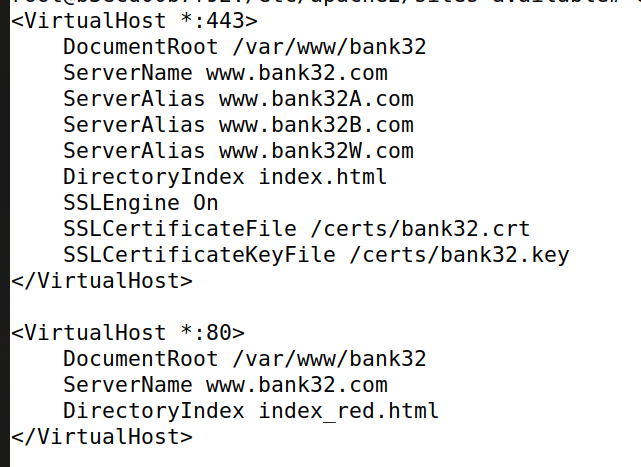

#### Depois da Alteração

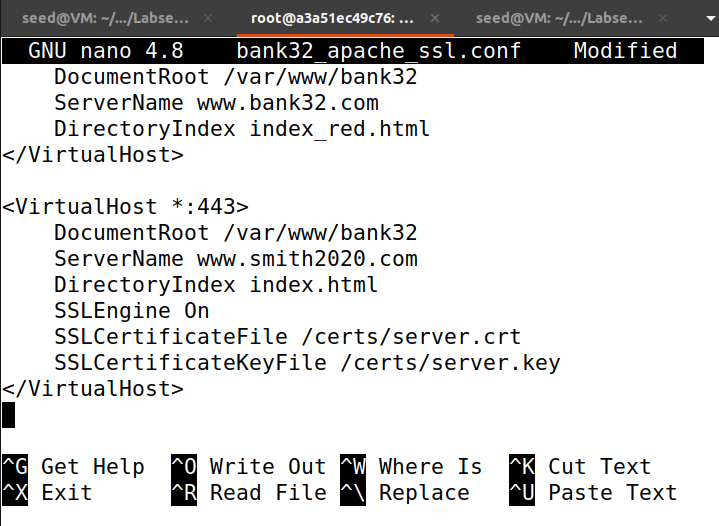

O nosso objetivo é o seguinte: quando um usuário tentar aceder a `www.bank32.com`, iremos redirecioná-lo para o nosso servidor, que hospeda um site falso para `www.smith2020.com`. Se este fosse um site de rede social, o site falso poderia exibir uma página de login semelhante à do site alvo. Se os usuários não conseguirem perceber a diferença, podem digitar suas credenciais de conta na página falsa, essencialmente revelando essas credenciais ao atacante.

### 3. Browse the target website  

Entramos no site `www.smith2020.com`, que nos apresenta uma mensagem de potencial risco de segurança.

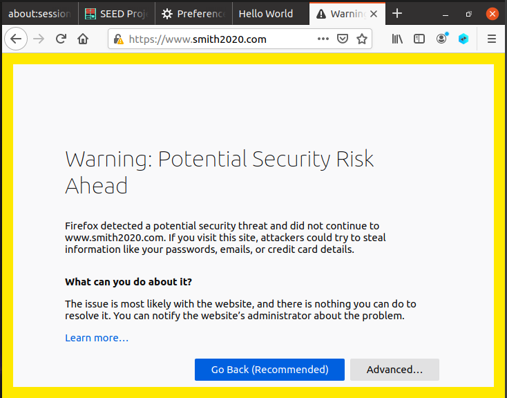

Carregamos em "Advanced" e selecionamos a opção "Accept the Risk and Continue". Este warning aparece porque o browser deteta que o certificado apresentado pelo servidor não corresponde ao domínio que estamos a aceder, o que é uma medida de segurança para evitar ataques como man-in-the-middle.

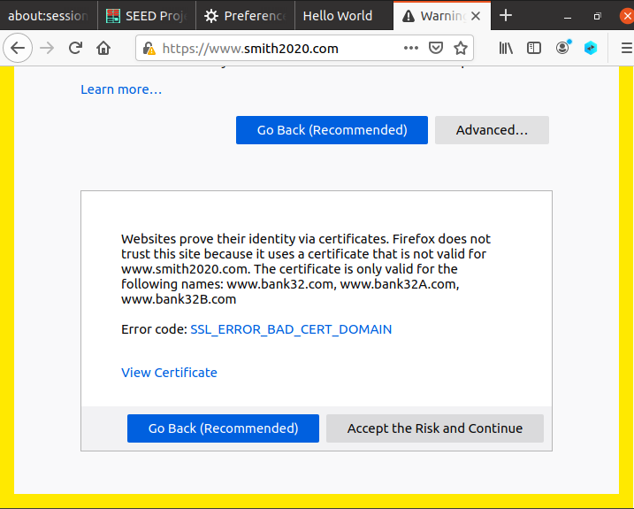  
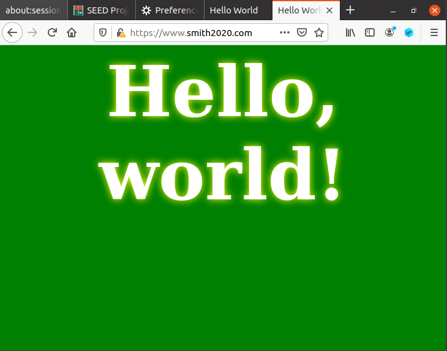

Após aceitar o risco e continuar, somos redirecionados para a página do site falso hospedado no nosso servidor. O site carrega com uma imagem que simula o www.bank32.com, confirmando que o redirecionamento e a configuração do servidor foram realizados com sucesso e que o ataque pode ser realizado como planeado.
    
## Task 6: Launching a Man-In-The-Middle Attack with a Compromised CA

Nesta tarefa, assumimos que a CA criada na Tarefa 1 foi comprometida por um atacante, e que sua chave privada foi roubada. Portanto, o atacante pode gerar qualquer certificado arbitrário usando a chave privada dessa CA.

### 1. Gerar um novo `.csr`  

Como temos acesso à private key `ca.key` conseguimos gerar um novo CSR, através do comando:

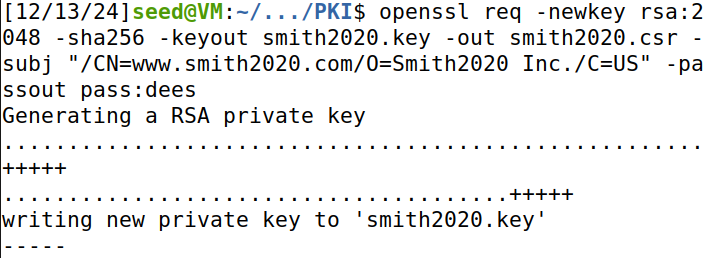


### 2. Gerar um novo `.crt`

Em seguida usamos a recém criada CSR para criar um novo certificado CRT para o site `www.smith2020.com`:

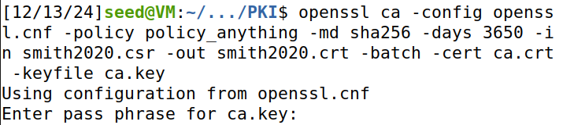

O output que obtivemos foi o seguinte, confirmando a criação do certificado:

    Check that the request matches the signature
    Signature ok
    Certificate Details:
            Serial Number: 4103 (0x1007)
            Validity
                Not Before: Dec 13 12:17:07 2024 GMT
                Not After : Dec 11 12:17:07 2034 GMT
            Subject:
                countryName               = US
                organizationName          = Smith2020 Inc.
                commonName                = www.smith2020.com
            X509v3 extensions:
                X509v3 Basic Constraints: 
                    CA:FALSE
                Netscape Comment: 
                    OpenSSL Generated Certificate
                X509v3 Subject Key Identifier: 
                    CE:1F:9E:C7:39:49:7F:F2:5A:B6:92:9F:D0:D0:B4:32:04:BF:08:36
                X509v3 Authority Key Identifier: 
                    keyid:87:62:AE:A4:0C:A5:AA:39:83:F0:16:07:88:EB:D4:82:FF:6B:4B:E6

    Certificate is to be certified until Dec 11 12:17:07 2034 GMT (3650 days)

    Write out database with 1 new entries
    Data Base Updated

### 3. Modificar `bank32_apache_ssl.conf`

Copiamos os recém criados `smith2020.csr` e `smith2020.crt` para o diretório "certs":

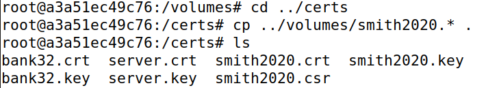

Depois modificamos `bank32_apache_ssl.conf`, adicionando os ficheiros `smith2020.csr` e `smith2020.crt` criados:

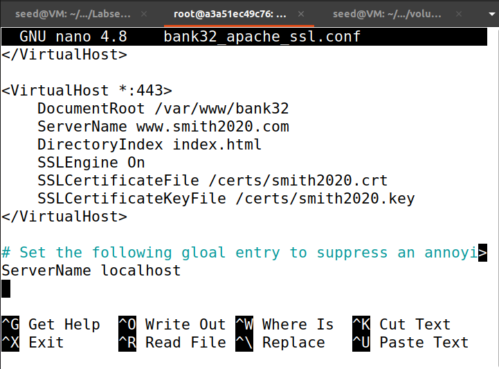

Por fim reiniciamos o nosso serviço Apache:

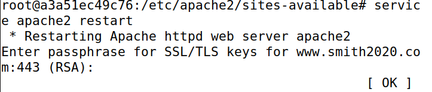

### 4. Aceder ao site 

Ao navegarmos para `https:\\www.smith2020.com` novamente verificamos que agora a conexão já era segura e que o browser não levantou nenhuma suspeita ao aceder ao website, indicando o sucesso do atque MITM:

#### Antes do Ataque 
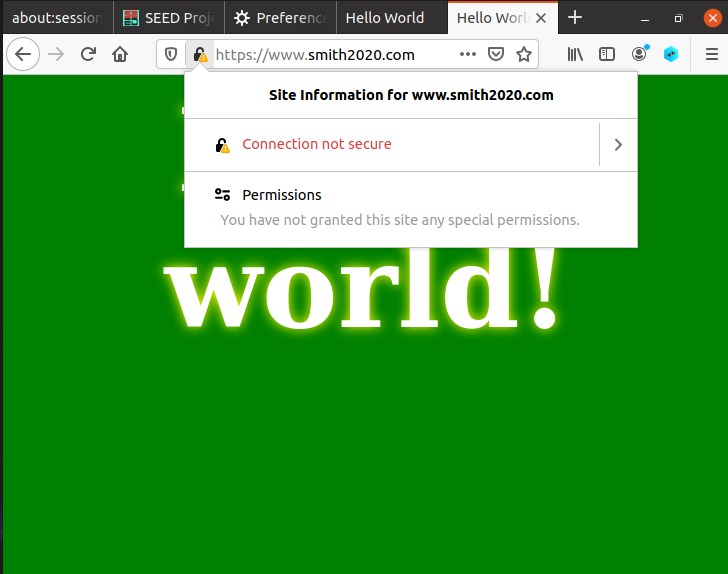

#### Depois do Ataque
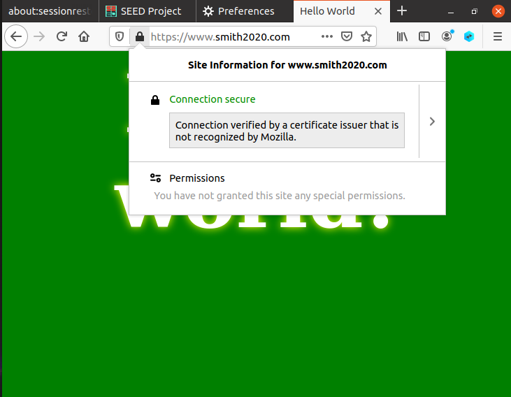


## Questão 2

Indique um mecanismo que permita reagir a essa ocorrência e impedir ataques, e que medidas um adversário pode tomar para evitar que esse mecanismo o impeça de tirar partido de uma autoridade de certificação comprometida.

### Mecanismo que permite reagir ao Comprometimento de uma Autoridade de Certificação

Um mecanismo para reagir ao comprometimento de uma autoridade de certificação é o uso de Certificate Revocation Lists (CRLs). As CRLs são listas de certificados não confiáveis mantidas pelas autoridades de certificação. Antes de estabelecer uma conexão segura, o browser verifica se o certificado do site está presente na CRL, e, caso esteja, a conexão é bloqueada.

### Medidas que Adversário toma para evitar que esse Mecanismo o Impeça

Um adversário pode tentar contornar os CRLs realizando ataques de Denial of Service (DoS) nos servidores de CRLs, impedindo o browser de aceder a esta lista e de a verificar resultando, potencialmente, na permissão do uso de certificados comprometidos.