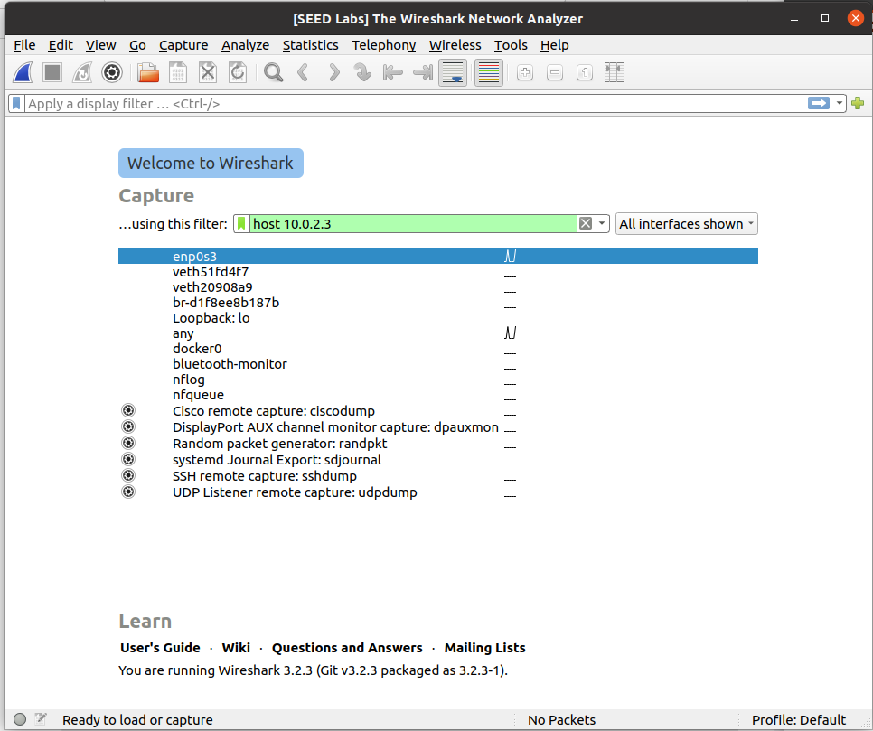

# Relatório: Sniffing and Spoofing Lab

## Configuração Inicial
1. **Configuração da Máquina Virtual:**
   - Identificámos os seguintes containers e os seus IPs:
     - Host A: `10.9.0.5`
     - Host B: `10.9.0.6`
     - Attacker: `seed-attacker`
   - Verificámos as interfaces de rede no `seed-attacker`. A interface relevante para sniffing foi identificada como `br-803e0bb79596`.


   
2. **Implementação Inicial do Sniffer:**
   - Criámos o script `sniffer.py` para capturar pacotes ICMP:
     ```python
     #!/usr/bin/env python3
     from scapy.all import *

     # Definir uma função de callback para processar os pacotes capturados
     def print_pkt(pkt):
         pkt.show()

     # Capturar pacotes numa interface específica
     pkt = sniff(iface='br-803e0bb79596', filter='icmp', prn=print_pkt)
     ```


   - Abrimos o root do Attacker (seed-attacker):
     ``` docksh a8 ```


   - Tornámos o script executável utilizando:
     ```bash
     chmod a+x sniffer.py
     ```


   - Executámos o script utilizando:
     ```bash
     sudo ./sniffer.py
     ```

## Tarefa 1.1A: Captura de Pacotes ICMP
- **Passos de Teste:**
  - Executámos o script do sniffer no `seed-attacker`.
  - No Host A (`10.9.0.5`), gerámos pacotes ICMP utilizando o comando:
    ```bash
    ping 10.9.0.6
    ```


  - Observámos os pacotes ICMP capturados na saída do sniffer no `seed-attacker`.


```
###[ Ethernet ]### 
  dst       = 02:42:27:6f:3f:fc
  src       = 02:42:0a:09:00:05
  type      = IPv4
###[ IP ]### 
     version   = 4
     ihl       = 5
     tos       = 0x0
     len       = 84
     id        = 17181
     flags     = DF
     frag      = 0
     ttl       = 64
     proto     = icmp
     chksum    = 0xe374
     src       = 10.9.0.5
     dst       = 10.9.0.1
     \options   \
###[ ICMP ]### 
        type      = echo-request
        code      = 0
        chksum    = 0x8dd0
        id        = 0x1d
        seq       = 0x1
###[ Raw ]### 
           load      = '\x02\x9dbg\x00\x00\x00\x00@:\x06\x00\x00\x00\x00\x00\x10\x11\x12\x13\x14\x15\x16\x17\x18\x19\x1a\x1b\x1c\x1d\x1e\x1f !"#$%&\'()*+,-./01234567'

###[ Ethernet ]### 
  dst       = 02:42:0a:09:00:05
  src       = 02:42:27:6f:3f:fc
  type      = IPv4
###[ IP ]### 
     version   = 4
     ihl       = 5
     tos       = 0x0
     len       = 84
     id        = 3209
     flags     = 
     frag      = 0
     ttl       = 64
     proto     = icmp
     chksum    = 0x5a09
     src       = 10.9.0.1
     dst       = 10.9.0.5
     \options   \
###[ ICMP ]### 
        type      = echo-reply
        code      = 0
        chksum    = 0x95d0
        id        = 0x1d
        seq       = 0x1
###[ Raw ]### 
           load      = '\x02\x9dbg\x00\x00\x00\x00@:\x06\x00\x00\x00\x00\x00\x10\x11\x12\x13\x14\x15\x16\x17\x18\x19\x1a\x1b\x1c\x1d\x1e\x1f !"#$%&\'()*+,-./01234567'

###[ Ethernet ]### 
  dst       = 02:42:27:6f:3f:fc
  src       = 02:42:0a:09:00:05
  type      = IPv4
###[ IP ]### 
     version   = 4
     ihl       = 5
     tos       = 0x0
     len       = 84
     id        = 17192
     flags     = DF
     frag      = 0
     ttl       = 64
     proto     = icmp
     chksum    = 0xe369
     src       = 10.9.0.5
     dst       = 10.9.0.1
     \options   \
###[ ICMP ]### 
        type      = echo-request
        code      = 0
        chksum    = 0x3c5
        id        = 0x1d
        seq       = 0x2
###[ Raw ]### 
           load      = '\x03\x9dbg\x00\x00\x00\x00\xc9D\x06\x00\x00\x00\x00\x00\x10\x11\x12\x13\x14\x15\x16\x17\x18\x19\x1a\x1b\x1c\x1d\x1e\x1f !"#$%&\'()*+,-./01234567'

###[ Ethernet ]### 
  dst       = 02:42:0a:09:00:05
  src       = 02:42:27:6f:3f:fc
  type      = IPv4
###[ IP ]### 
     version   = 4
     ihl       = 5
     tos       = 0x0
     len       = 84
     id        = 3375
     flags     = 
     frag      = 0
     ttl       = 64
     proto     = icmp
     chksum    = 0x5963
     src       = 10.9.0.1
     dst       = 10.9.0.5
     \options   \
###[ ICMP ]### 
        type      = echo-reply
        code      = 0
        chksum    = 0xbc5
        id        = 0x1d
        seq       = 0x2
###[ Raw ]### 
           load      = '\x03\x9dbg\x00\x00\x00\x00\xc9D\x06\x00\x00\x00\x00\x00\x10\x11\x12\x13\x14\x15\x16\x17\x18\x19\x1a\x1b\x1c\x1d\x1e\x1f !"#$%&\'()*+,-./01234567'

###[ Ethernet ]### 
  dst       = 02:42:27:6f:3f:fc
  src       = 02:42:0a:09:00:05
  type      = IPv4
###[ IP ]### 
     version   = 4
     ihl       = 5
     tos       = 0x0
     len       = 84
     id        = 17383
     flags     = DF
     frag      = 0
     ttl       = 64
     proto     = icmp
     chksum    = 0xe2aa
     src       = 10.9.0.5
     dst       = 10.9.0.1
     \options   \
###[ ICMP ]### 
        type      = echo-request
        code      = 0
        chksum    = 0x828a
        id        = 0x1d
        seq       = 0x3
###[ Raw ]### 
           load      = '\x04\x9dbg\x00\x00\x00\x00I~\x06\x00\x00\x00\x00\x00\x10\x11\x12\x13\x14\x15\x16\x17\x18\x19\x1a\x1b\x1c\x1d\x1e\x1f !"#$%&\'()*+,-./01234567'

###[ Ethernet ]### 
  dst       = 02:42:0a:09:00:05
  src       = 02:42:27:6f:3f:fc
  type      = IPv4
###[ IP ]### 
     version   = 4
     ihl       = 5
     tos       = 0x0
     len       = 84
     id        = 3576
     flags     = 
     frag      = 0
     ttl       = 64
     proto     = icmp
     chksum    = 0x589a
     src       = 10.9.0.1
     dst       = 10.9.0.5
     \options   \
###[ ICMP ]### 
        type      = echo-reply
        code      = 0
        chksum    = 0x8a8a
        id        = 0x1d
        seq       = 0x3
###[ Raw ]### 
           load      = '\x04\x9dbg\x00\x00\x00\x00I~\x06\x00\x00\x00\x00\x00\x10\x11\x12\x13\x14\x15\x16\x17\x18\x19\x1a\x1b\x1c\x1d\x1e\x1f !"#$%&\'()*+,-./01234567'

###[ Ethernet ]### 
  dst       = 02:42:27:6f:3f:fc
  src       = 02:42:0a:09:00:05
  type      = IPv4
###[ IP ]### 
     version   = 4
     ihl       = 5
     tos       = 0x0
     len       = 84
     id        = 17510
     flags     = DF
     frag      = 0
     ttl       = 64
     proto     = icmp
     chksum    = 0xe22b
     src       = 10.9.0.5
     dst       = 10.9.0.1
     \options   \
###[ ICMP ]### 
        type      = echo-request
        code      = 0
        chksum    = 0xd429
        id        = 0x1d
        seq       = 0x4
###[ Raw ]### 
           load      = '\x05\x9dbg\x00\x00\x00\x00\xf6\xdd\x06\x00\x00\x00\x00\x00\x10\x11\x12\x13\x14\x15\x16\x17\x18\x19\x1a\x1b\x1c\x1d\x1e\x1f !"#$%&\'()*+,-./01234567'

###[ Ethernet ]### 
  dst       = 02:42:0a:09:00:05
  src       = 02:42:27:6f:3f:fc
  type      = IPv4
###[ IP ]### 
     version   = 4
     ihl       = 5
     tos       = 0x0
     len       = 84
     id        = 3699
     flags     = 
     frag      = 0
     ttl       = 64
     proto     = icmp
     chksum    = 0x581f
     src       = 10.9.0.1
     dst       = 10.9.0.5
     \options   \
###[ ICMP ]### 
        type      = echo-reply
        code      = 0
        chksum    = 0xdc29
        id        = 0x1d
        seq       = 0x4
###[ Raw ]### 
           load      = '\x05\x9dbg\x00\x00\x00\x00\xf6\xdd\x06\x00\x00\x00\x00\x00\x10\x11\x12\x13\x14\x15\x16\x17\x18\x19\x1a\x1b\x1c\x1d\x1e\x1f !"#$%&\'()*+,-./01234567'
```

- **Sem Privilégios de Root:**
  - Tentámos executar o sniffer sem `sudo` (alterando o root para seed). Observámos que falhou devido a permissões insuficientes para aceder à interface de rede em modo promiscuous.


```
Traceback (most recent call last):
  File "./sniffer.py", line 6, in <module>
    pkt = sniff(iface='br-08e5b5ee6dcb', filter='icmp', prn=print_pkt)
  File "/usr/local/lib/python3.8/dist-packages/scapy/sendrecv.py", line 1036, in sniff
    sniffer._run(*args, **kwargs)
  File "/usr/local/lib/python3.8/dist-packages/scapy/sendrecv.py", line 906, in _run
    sniff_sockets[L2socket(type=ETH_P_ALL, iface=iface,
  File "/usr/local/lib/python3.8/dist-packages/scapy/arch/linux.py", line 398, in init
    self.ins = socket.socket(socket.AF_PACKET, socket.SOCK_RAW, socket.htons(type))  # noqa: E501
  File "/usr/lib/python3.8/socket.py", line 231, in init
    _socket.socket.init(self, family, type, proto, fileno)
PermissionError: [Errno 1] Operation not permitted
```


## Tarefa 1.1B: Aplicação de Filtros
### Filtro 1: Capturar Apenas Pacotes ICMP
- Modificámos o filtro para:
  ```python
  pkt = sniff(iface='br-803e0bb79596', filter='icmp', prn=print_pkt)
  ```
- Verificámos que apenas pacotes ICMP foram capturados.


```
###[ Ethernet ]### 
  dst       = 02:42:27:6f:3f:fc
  src       = 02:42:0a:09:00:05
  type      = IPv4
###[ IP ]### 
     version   = 4
     ihl       = 5
     tos       = 0x0
     len       = 84
     id        = 360
     flags     = DF
     frag      = 0
     ttl       = 64
     proto     = icmp
     chksum    = 0x252a
     src       = 10.9.0.5
     dst       = 10.9.0.1
     \options   \
###[ ICMP ]### 
        type      = echo-request
        code      = 0
        chksum    = 0x2f68
        id        = 0x1e
        seq       = 0x1
###[ Raw ]### 
           load      = '\xe1\x9ebg\x00\x00\x00\x00\xc4\x9f\x01\x00\x00\x00\x00\x00\x10\x11\x12\x13\x14\x15\x16\x17\x18\x19\x1a\x1b\x1c\x1d\x1e\x1f !"#$%&\'()*+,-./01234567'

###[ Ethernet ]### 
  dst       = 02:42:0a:09:00:05
  src       = 02:42:27:6f:3f:fc
  type      = IPv4
###[ IP ]### 
     version   = 4
     ihl       = 5
     tos       = 0x0
     len       = 84
     id        = 20412
     flags     = 
     frag      = 0
     ttl       = 64
     proto     = icmp
     chksum    = 0x16d6
     src       = 10.9.0.1
     dst       = 10.9.0.5
     \options   \
###[ ICMP ]### 
        type      = echo-reply
        code      = 0
        chksum    = 0x3768
        id        = 0x1e
        seq       = 0x1
###[ Raw ]### 
           load      = '\xe1\x9ebg\x00\x00\x00\x00\xc4\x9f\x01\x00\x00\x00\x00\x00\x10\x11\x12\x13\x14\x15\x16\x17\x18\x19\x1a\x1b\x1c\x1d\x1e\x1f !"#$%&\'()*+,-./01234567'

###[ Ethernet ]### 
  dst       = 02:42:27:6f:3f:fc
  src       = 02:42:0a:09:00:05
  type      = IPv4
###[ IP ]### 
     version   = 4
     ihl       = 5
     tos       = 0x0
     len       = 84
     id        = 467
     flags     = DF
     frag      = 0
     ttl       = 64
     proto     = icmp
     chksum    = 0x24bf
     src       = 10.9.0.5
     dst       = 10.9.0.1
     \options   \
###[ ICMP ]### 
        type      = echo-request
        code      = 0
        chksum    = 0x5c61
        id        = 0x1e
        seq       = 0x2
###[ Raw ]### 
           load      = '\xe2\x9ebg\x00\x00\x00\x00\x96\xa5\x01\x00\x00\x00\x00\x00\x10\x11\x12\x13\x14\x15\x16\x17\x18\x19\x1a\x1b\x1c\x1d\x1e\x1f !"#$%&\'()*+,-./01234567'

###[ Ethernet ]### 
  dst       = 02:42:0a:09:00:05
  src       = 02:42:27:6f:3f:fc
  type      = IPv4
###[ IP ]### 
     version   = 4
     ihl       = 5
     tos       = 0x0
     len       = 84
     id        = 20423
     flags     = 
     frag      = 0
     ttl       = 64
     proto     = icmp
     chksum    = 0x16cb
     src       = 10.9.0.1
     dst       = 10.9.0.5
     \options   \
###[ ICMP ]### 
        type      = echo-reply
        code      = 0
        chksum    = 0x6461
        id        = 0x1e
        seq       = 0x2
###[ Raw ]### 
           load      = '\xe2\x9ebg\x00\x00\x00\x00\x96\xa5\x01\x00\x00\x00\x00\x00\x10\x11\x12\x13\x14\x15\x16\x17\x18\x19\x1a\x1b\x1c\x1d\x1e\x1f !"#$%&\'()*+,-./01234567'

###[ Ethernet ]### 
  dst       = 02:42:27:6f:3f:fc
  src       = 02:42:0a:09:00:05
  type      = IPv4
###[ IP ]### 
     version   = 4
     ihl       = 5
     tos       = 0x0
     len       = 84
     id        = 577
     flags     = DF
     frag      = 0
     ttl       = 64
     proto     = icmp
     chksum    = 0x2451
     src       = 10.9.0.5
     dst       = 10.9.0.1
     \options   \
###[ ICMP ]### 
        type      = echo-request
        code      = 0
        chksum    = 0x2746
        id        = 0x1e
        seq       = 0x3
###[ Raw ]### 
           load      = '\xe3\x9ebg\x00\x00\x00\x00\xca\xbf\x01\x00\x00\x00\x00\x00\x10\x11\x12\x13\x14\x15\x16\x17\x18\x19\x1a\x1b\x1c\x1d\x1e\x1f !"#$%&\'()*+,-./01234567'

###[ Ethernet ]### 
  dst       = 02:42:0a:09:00:05
  src       = 02:42:27:6f:3f:fc
  type      = IPv4
###[ IP ]### 
     version   = 4
     ihl       = 5
     tos       = 0x0
     len       = 84
     id        = 20561
     flags     = 
     frag      = 0
     ttl       = 64
     proto     = icmp
     chksum    = 0x1641
     src       = 10.9.0.1
     dst       = 10.9.0.5
     \options   \
###[ ICMP ]### 
        type      = echo-reply
        code      = 0
        chksum    = 0x2f46
        id        = 0x1e
        seq       = 0x3
###[ Raw ]### 
           load      = '\xe3\x9ebg\x00\x00\x00\x00\xca\xbf\x01\x00\x00\x00\x00\x00\x10\x11\x12\x13\x14\x15\x16\x17\x18\x19\x1a\x1b\x1c\x1d\x1e\x1f !"#$%&\'()*+,-./01234567'
```

### Filtro 2: Capturar Pacotes TCP de uma Fonte Específica para a Porta 23
- Modificámos o filtro para:
  ```python
  pkt = sniff(iface='br-803e0bb79596', filter='tcp and src host 10.9.0.5 and dst port 23', prn=print_pkt)
  ```


- No Host A (`10.9.0.5`), gerámos tráfego TCP para a porta 23 utilizando:
  ```bash
  telnet 10.9.0.6 23
  ```


- Observámos os pacotes TCP capturados na saída do sniffer no `seed-attacker`.

```
###[ Ethernet ]### 
  dst       = 02:42:27:6f:3f:fc
  src       = 02:42:0a:09:00:05
  type      = IPv4
###[ IP ]### 
     version   = 4
     ihl       = 5
     tos       = 0x10
     len       = 55
     id        = 2032
     flags     = DF
     frag      = 0
     ttl       = 64
     proto     = tcp
     chksum    = 0x1eaa
     src       = 10.9.0.5
     dst       = 10.9.0.1
     \options   \
###[ TCP ]### 
        sport     = 50742
        dport     = telnet
        seq       = 577194010
        ack       = 510969097
        dataofs   = 8
        reserved  = 0
        flags     = PA
        window    = 501
        chksum    = 0x1441
        urgptr    = 0
        options   = [('NOP', None), ('NOP', None), ('Timestamp', (2006280466, 1519635405))]
###[ Raw ]### 
           load      = '\x1b[A'

###[ Ethernet ]### 
  dst       = 02:42:27:6f:3f:fc
  src       = 02:42:0a:09:00:05
  type      = IPv4
###[ IP ]### 
     version   = 4
     ihl       = 5
     tos       = 0x10
     len       = 52
     id        = 2033
     flags     = DF
     frag      = 0
     ttl       = 64
     proto     = tcp
     chksum    = 0x1eac
     src       = 10.9.0.5
     dst       = 10.9.0.1
     \options   \
###[ TCP ]### 
        sport     = 50742
        dport     = telnet
        seq       = 577194013
        ack       = 510969106
        dataofs   = 8
        reserved  = 0
        flags     = A
        window    = 501
        chksum    = 0x143e
        urgptr    = 0
        options   = [('NOP', None), ('NOP', None), ('Timestamp', (2006280494, 1519875717))]

###[ Ethernet ]### 
  dst       = 02:42:27:6f:3f:fc
  src       = 02:42:0a:09:00:05
  type      = IPv4
###[ IP ]### 
     version   = 4
     ihl       = 5
     tos       = 0x10
     len       = 55
     id        = 2034
     flags     = DF
     frag      = 0
     ttl       = 64
     proto     = tcp
     chksum    = 0x1ea8
     src       = 10.9.0.5
     dst       = 10.9.0.1
     \options   \
###[ TCP ]### 
        sport     = 50742
        dport     = telnet
        seq       = 577194013
        ack       = 510969106
        dataofs   = 8
        reserved  = 0
        flags     = PA
        window    = 501
        chksum    = 0x1441
        urgptr    = 0
        options   = [('NOP', None), ('NOP', None), ('Timestamp', (2006281315, 1519875717))]
###[ Raw ]### 
           load      = '\x1b[B'

###[ Ethernet ]### 
  dst       = 02:42:27:6f:3f:fc
  src       = 02:42:0a:09:00:05
  type      = IPv4
###[ IP ]### 
     version   = 4
     ihl       = 5
     tos       = 0x10
     len       = 52
     id        = 2035
     flags     = DF
     frag      = 0
     ttl       = 64
     proto     = tcp
     chksum    = 0x1eaa
     src       = 10.9.0.5
     dst       = 10.9.0.1
     \options   \
###[ TCP ]### 
        sport     = 50742
        dport     = telnet
        seq       = 577194016
        ack       = 510969118
        dataofs   = 8
        reserved  = 0
        flags     = A
        window    = 501
        chksum    = 0x143e
        urgptr    = 0
        options   = [('NOP', None), ('NOP', None), ('Timestamp', (2006281321, 1519876544))]

###[ Ethernet ]### 
  dst       = 02:42:27:6f:3f:fc
  src       = 02:42:0a:09:00:05
  type      = IPv4
###[ IP ]### 
     version   = 4
     ihl       = 5
     tos       = 0x10
     len       = 70
     id        = 2036
     flags     = DF
     frag      = 0
     ttl       = 64
     proto     = tcp
     chksum    = 0x1e97
     src       = 10.9.0.5
     dst       = 10.9.0.1
     \options   \
###[ TCP ]### 
        sport     = 50742
        dport     = telnet
        seq       = 577194016
        ack       = 510969118
        dataofs   = 8
        reserved  = 0
        flags     = PA
        window    = 501
        chksum    = 0x1450
        urgptr    = 0
        options   = [('NOP', None), ('NOP', None), ('Timestamp', (2006293390, 1519876544))]
###[ Raw ]### 
           load      = 'telnet 10.9.0.1 23'

###[ Ethernet ]### 
  dst       = 02:42:27:6f:3f:fc
  src       = 02:42:0a:09:00:05
  type      = IPv4
###[ IP ]### 
     version   = 4
     ihl       = 5
     tos       = 0x10
     len       = 52
     id        = 2037
     flags     = DF
     frag      = 0
     ttl       = 64
     proto     = tcp
     chksum    = 0x1ea8
     src       = 10.9.0.5
     dst       = 10.9.0.1
     \options   \
###[ TCP ]### 
        sport     = 50742
        dport     = telnet
        seq       = 577194034
        ack       = 510969136
        dataofs   = 8
        reserved  = 0
        flags     = A
        window    = 501
        chksum    = 0x143e
        urgptr    = 0
        options   = [('NOP', None), ('NOP', None), ('Timestamp', (2006293402, 1519888625))]

###[ Ethernet ]### 
  dst       = 02:42:27:6f:3f:fc
  src       = 02:42:0a:09:00:05
  type      = IPv4
###[ IP ]### 
     version   = 4
     ihl       = 5
     tos       = 0x10
     len       = 54
     id        = 2038
     flags     = DF
     frag      = 0
     ttl       = 64
     proto     = tcp
     chksum    = 0x1ea5
     src       = 10.9.0.5
     dst       = 10.9.0.1
     \options   \
###[ TCP ]### 
        sport     = 50742
        dport     = telnet
        seq       = 577194034
        ack       = 510969136
        dataofs   = 8
        reserved  = 0
        flags     = PA
        window    = 501
        chksum    = 0x1440
        urgptr    = 0
        options   = [('NOP', None), ('NOP', None), ('Timestamp', (2006293819, 1519888625))]
###[ Raw ]### 
           load      = '\r\x00'

```

### Filtro 3: Capturar Pacotes para/da Subrede
- Modificámos o filtro para:
  ```python
  pkt = sniff(iface='br-803e0bb79596', filter='net 128.230.0.0/16', prn=print_pkt)
  ```
- No Host A (`10.9.0.5`), tentámos gerar tráfego para a subrede:
  ```bash
  ping 128.230.0.1
  ```
- Conseguimos gerar os seguintes pacotes:

```
(completar)
```


## Task 2 - Spoofing ICMP Packets

Como uma ferramenta de spoofing de pacotes, o Scapy nos permite definir os campos dos pacotes IP com valores arbitrários. O objetivo desta tarefa é forjar pacotes IP com um endereço IP de origem arbitrário. Vamos forjar pacotes de solicitação ICMP echo e enviá-los para outra VM na mesma rede. Usaremos o Wireshark para observar se nossa solicitação será aceita pelo receptor. Se for aceita, um pacote de resposta echo será enviado para o endereço IP forjado.


Agora abrimos o Wireshark e acessamos o IP que colocamos no script anterior



Executamos o script 


Logo podemos ver o IP do host e o do receiver


Adicionamos `la(a)` no script para ver os IPs no terminal


## Task 3 - Traceroute

O objetivo desta tarefa é usar o Scapy para estimar a distância, em termos de número de roteadores, entre sua VM e um destino selecionado.

Começamos com 1 em `time to live`


Após tornar o script executável e dar suas devidas perissões 


Logo podemos verificar no wireshark 


Aqui podemos ver o primeiro roteador em que o programa "para" e, em seguida, recebemos uma resposta junto com o IP do roteador.


Aqui podemos verificar o nosso resultado através da função `tracerouter`


## Task 4 

Nesta tarefa, nós iremos combinar as técnicas de sniffing e spoofing para implementar o seguinte programa de sniffing e depois spoofing. Nessa task utilizamos um script fornecido [aqui](https://www.youtube.com/watch?v=Qh9BxoCB_Dc)


### ping 1.2.3.4 - a non-existing host on the Internet

Aqui estamos "sniffing" alguns pacotes 


###  ping 10.9.0.99 - a non-existing host on the LAN


A LAN, não há nenhum registro ou mapping, logo quando damos ping no IP ARP não pode ser criado


### ping 8.8.8.8 - an existing host on the Internet


Neste caso `(DUP!)` quer dizer duplicado, nesse sentido não sabemos qual é o verdadeiro ou não 


