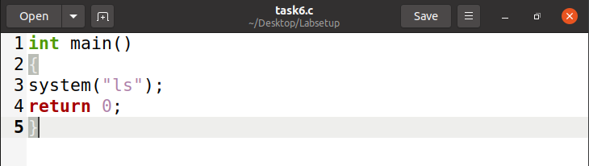
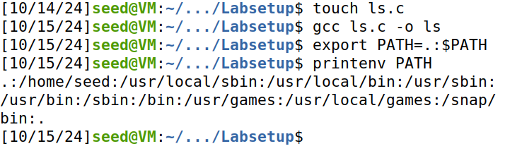

# Relatório: Environment Variable and Set-UID Program Lab

Este documento detalha todo o processo de resolução das tarefas especificadas no guião Environment Variable and Set-UID Program Lab. 

## Task 1: Manipulating Environment Variables

Nesta tarefa, exploramos como manipular environment variables utilizando o Bash:

1. Começamos por declarar a variável `AAAA` com o valor `teste`, estando esta apenas disponível na shell atual.

2. Com o comando `printenv AAA` confirmamos que `AAAA` é uma local variable, uma vez que `printenv` apenas mostra environment variables.

3. Fazendo o `export`, a local variable passa a ser uma environment variable e passa a ser exibida pelo comando `printenv`. 

4. Criamos um child process com o comando `bash` e mostramos, através de `printenv AAAA`, que a environment variable criada foi herdada.

5. Removemos a variável `AAAA` do child process com `unset AAAA`, confirmando que não obtínhamos nenhum valor com o `printenv`. 

6. Por fim, fizemos uma análise do pid através do comando `echo $$`. O primeiro valor obtido foi 2594, e o segundo, após iniciarmos uma nova shell, foi 2625, confirmando que `bash` cria um processo diferente. 

Os comandos executados e descritos anteriormente encontram-se na Figura 1.

*Figura 1: Manipulating Environment Variables*

## Task 2: Passing Environment Variables from Parent Process to Child Process

Na tarefa 2, estudamos se um child process obtém as environment variables do parent process ou não, utilizando o `fork()`.

1. Após compilar e correr o programa `myprintenv.c` com `printenv()` comentado para o parent process, o ficheiro de output `file` mostra as environment variables impressas pelo child process (Figura 2).

    

    *Figura 2: Child Process Environment Variables depois do fork()*

2. Correndo `myprintenv.c` com `printenv()` comentado para o child process, o ficheiro de output `file_after_change` mostra as environment variables impressas pelo parent process (Figura 3).

    

    *Figura 3: Parent Process Environment Variables depois do fork()*

3. Comparando os dois ficheiros, nenhuma diferença é observada (Figura 4), o que demonstra que o child process herda as environment variables do parent através do `fork()`.

    

    *Figura 4: Diferença entre Environment Variables do Parent e do Child Process*
    

## Task 3: Environment Variables and execve()

Nesta tarefa, analisamos o que é que acontece às environment variables quando um novo programa é executado através da função `execve()`. 

Os comandos executados foram os da Figura 5.

*Figura 5: Comandos executados na Task 3*

1. Executanto `execve("/usr/bin/env", argv, NULL)`, o novo programa `/usr/bin/env` é executado e não imprime nenhuma environment variable (Figura 6).

    ![execve() com envp[]=NULL](Images/LOGBOOK4/Task3_image1.png)

    *Figura 6: Environment variables depois de execve() com envp[]=NULL*

2. Executanto `execve("/usr/bin/env", argv, environ)`, o novo programa `/usr/bin/env` imprime todas as environment variables do processo original (Figura 7).

    ![execve() com envp[]=environ](Images/LOGBOOK4/Task3_image2.png)

    *Figura 7: Environment variables depois de execve() com envp[]=environ*

Assim, é possível concluir que para as environment variables serem herdadas pelo novo programa, estas têm que ser passadas como 3º argumento de `execve()`. 

## Task 4: Environment Variables and system()

Na tarefa 4, estudamos o que é que acontece às environment variables quando um novo programa é executado através da função `system()`. 

O comando `/usr/bin/env` exibe todas as environment variables do processo atual.

O programa a ser executado nesta tarefa (Figura 8) usa a função `system()` e passa `/usr/bin/env` como parâmetro.

 

*Figura 8: Programa com a função system().*

Executou-se o programa da Figura 8 utilizando os comandos da Figura 9.

 

*Figura 9: Comandos executados durante a Task 4.*

O ficheiro 'task4' obtido como resultado (Figura 10) contém todas as environment variables que estavam definidas no parent process.

 

*Figura 10: Conteúdo do ficheiro 'task4'.*

Assim, conclui-se que a função `system()`, ao utilizar `/usr/bin/env` como parâmetro, faz com que o child process herde todas as environment variables do parent process.

## Task 5: Environment Variable and Set-UID Programs

Na tarefa 5 analisamos de que forma é que as environment variables do processo do user são herdadas pelo processo do programa Set-UID 

1. Começamos por escrever um programa que imprime todas as environment variables do processo atual (Figura 11).

     

    *Figura 11: programa que imprime as environment variables*

2. De seguida compilamos e executamos o programa da Figura 11 com os comandos da Figura 12 e observamos as variáveis de ambiente do processo atual no ficheiro task5_1 (Figura 13).

    

    *Figura 12: comandos para compilar e executar o programa que imprime as environment variables*

    

    *Figura 13: environment variables do processo atual*

3. Depois da compilação, transformamos o programa num programa Set-UID, com permissões de root, utilizando as instruções da Figura 14. Estas permissões permitem que qualquer user execute o programa com privilégios de root.

    - `sudo chown root task5_1`: altera o proprietário para root 
    - `sudo chmod 4755 task5_1`: define permissões Set-UID

    

    *Figura 14: instruções para transformar o programa em Set-UID com permissões de root*

4. Confirmamos se estávamos na shell do nosso user (seed) através da instrução `whoami`. Depois utilizamos `export` para definir as seguintes environment variables, quando não existiam:
 
- `PATH` - já existia como environment variable
- `LD_LIBRARY_PATH` - já existia como environment variable
- `testVar` - variável criada por nós com um valor de teste

    

    *Figura 15: definição de variáveis de ambiente no user seed*

5. Executamos o programa SET-UID novamente e verificamos que as variáveis `PATH` e `testVar` estavam nas variáveis de ambiente do programa. No entanto, `LD_LIBRARY_PATH` não. 

    

    *Figura 16: variáveis de ambiente após execução do programa SET-UID*

A variável `LD_LIBRARY_PATH` permite ao user definir um caminho personalizado para bibliotecas partilhadas. Se a variável fosse herdada por um programa Set-UID, haveria o risco de ser explorada num ataque, podendo o seu valor ser substituido por um caminho para bibliotecas maliciosas. Assim, por motivos de segurança, algumas variáveis de ambiente são removidas durante a execução de programas com privilégios elevados 

## Task 6: The PATH Environment Variable and Set-UID Programs

### Step 1

Para realizar o ataque, é necessário alterar a variável de ambiente PATH, de modo a incluir o nosso diretório atual (/home/seed). Isso vai permitir que o programa my_program execute o nosso código malicioso em vez de usar o comando /bin/ls original.

### Step 2

Escrever um programa simples em C que usa a função system() para chamar o comando ls.

### Step 3

Depois de guardar o ficheiro task6.c, utilizamos o compilador GCC para o compilar e corremos o código, verificando que o ficheiro não possuía root privileges:

### Step 4

1. Mudar a propriedade do programa compilado (my_program) para root

2. Definir o bit Set-UID para permitir que o programa seja executado com privilégios de root

 

### Step 5

Criamos o nosso próprio programa malicioso ls, que será executado em vez do /bin/ls, graças à manipulação do PATH.

1. Cria um novo ficheiro C chamado ls.c com o seguinte código malicioso:

2. Compila o programa malicioso:

### Step 6 

Quando voltámos a executar o my_program, este executou o programa ls malicioso em vez de /bin/ls, graças à variável PATH alterada.

 

### Step 7

Verificámos se o nosso código malicioso estava a ser executado com privilégios de root.

Para isso, modificámos o programa malicioso ls.c para criar um ficheiro no diretório /root, o que confirmaria que está a ser executado como root:

### Step 8

Recompilámos o programa e, após o executar, verificámos se o ficheiro /root/task6 foi criado:

Breve Explicação:

Este ataque funciona porque a função system("ls") é executada usando a variável de ambiente PATH. Ao alterar a variável PATH, consegimos "enganar" o programa, de maneira a que este execute o código personalizado em vez do comando de sistema pretendido (/bin/ls).

## Task 8: Invoking External Programs Using system() versus execve()

### Step 1 

Sim, Bob pode comprometer o sistema usando a versão com `system()` deste programa devido ao fato de que ele invoca um shell `(/bin/sh)` para executar comandos. Isso abre vulnerabilidades de segurança, incluindo manipulação de caminho e injeção de comandos.

Um exemplo prático:

#### Primeiro do uma maior autoridade a o meu catall.c

#### Em seguida, eu injetei um comando no catall.c que, ao ser executado, apaga o arquivo teste.c.

